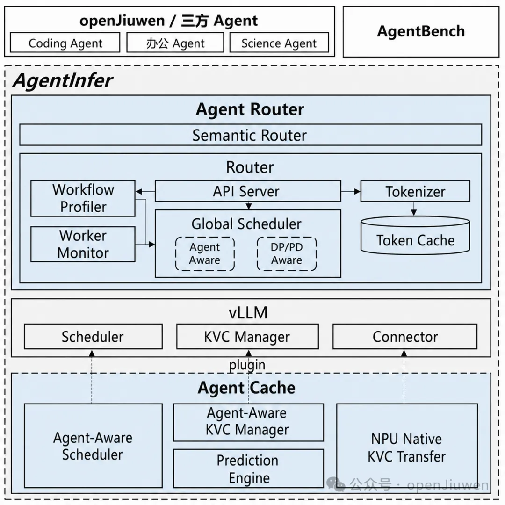

# AgentInfer

AgentInfer 为智能体工作流提供缓存管理和请求调度能力，可集成到 vLLM 等 LLM 推理引擎中或作为前置请求路由器运行。

[English](README.md)

## 核心特性

- **Semantic Router（语义路由）**：面向异构 LLM 推理的可编程 Mixture-of-Models 路由器，通过连续性感知的
  模型选择优化多轮智能体会话，减少破坏性且高代价的模型切换。
- **Router（路由器）**：面向 vLLM 大规模部署的高性能、轻量级路由器，提供 Agent 感知调度策略与
  智能体工作流建模。
- **Agent Cache（智能体缓存）**：vLLM 插件，在智能体工作负载下负责请求调度以及 Ascend NPU 原生
  KV Cache 管理、池化与传输。
- **AgentBench（基准测试）**：面向智能体工作负载下推理引擎的基准测试，支持真实智能体运行与
  轨迹数据集回放两种模式。

## 架构



## 相关文档

[文档导航](docs/README.md) · [快速开始](docs/zh/tutorial/01-quick-start.md) ·
[vLLM 接入](docs/zh/how-to/integrate-vllm.md) · [基准测试指南](docs/zh/how-to/run-benchmark.md) ·
[AgentRouter middleware 补丁](agentinfer/agentrouter/README.md) · [变更日志](CHANGELOG.md)

## 环境要求

- 操作系统：Linux，或安装了 WSL 2 的 Windows。
- Python：3.10 或更高版本，与 `pyproject.toml` 中的 `requires-python` 保持一致。
- 推理运行时：vLLM 0.23.0。
- 硬件：与 vLLM 兼容且能够运行所选模型的 CUDA GPU。

AgentInfer 必须与 vLLM 安装在同一 Python 环境中。

## 安装指南

### 从源码安装

开发环境中，先激活目标 vLLM 环境，再以可编辑模式安装 AgentInfer：

```bash
git clone https://gitcode.com/openJiuwen/agent-infer.git
cd agent-infer
python -m pip install -e .
```

### 安装发布包

下载 [AgentInfer 0.1.0 wheel][release-wheel]，然后在目标 vLLM 环境中安装：

```bash
python -m pip install agentinfer-0.1.0-py3-none-any.whl
```

## Quick Start

使用单一参数启动 AgentInfer 服务路径：

```bash
vllm serve meta-llama/Llama-3.1-8B-Instruct --agentinfer
```

未设置 `AGENTCACHE_VLLM_LIFECYCLE_SOCKET` 时，生命周期 socket 默认为
`/tmp/agentinfer-vllm-lifecycle.sock`；同一主机上的多个服务实例需分别导出不同的 socket。
仓库中的等效示例位于 [`examples/serve-progress-ttl.sh`](examples/serve-progress-ttl.sh)。

安装后的 `vllm` 命令会将普通命令委托给上游 vLLM。显式的 `vllm bench serve --agentinfer` 命令进入
AgentBench；`vllm serve MODEL --agentinfer` 激活 AgentInfer 服务路径；其他命令原样委托给上游。标准服务参数见
[vLLM Quickstart](https://docs.vllm.ai/en/latest/getting_started/quickstart/)。

## License

本项目基于 [Apache License 2.0](LICENSE) 开源。

本产品仅作为流程编排工具，不包含 AI 模型能力；用户在连接 AI 模型用于特定业务场景时，需自行承担欧盟 AI 法案等相关合规义务。

[release-wheel]: https://gitcode.com/openJiuwen/agent-infer/releases/download/0.1.0/agentinfer-0.1.0-py3-none-any.whl
