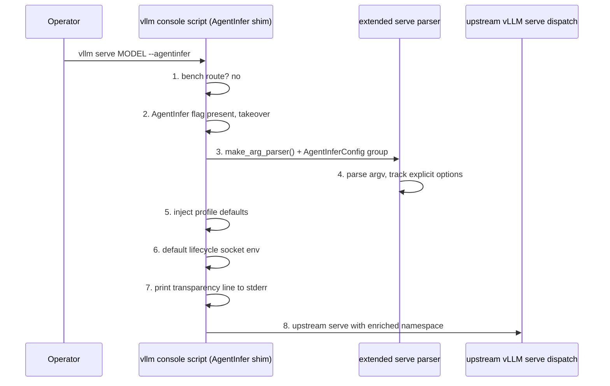

# AgentInfer serve flag (`vllm serve MODEL --agentinfer`)

## Purpose and boundary

This design collapses the four-flag Progress-TTL serving incantation into one operator-facing flag on the existing
AgentInfer `vllm` console script. The canonical command becomes:

```bash
vllm serve MODEL --agentinfer
```

The flag is implemented as **a serve-parser extension**: when the flag is present, the shim reuses upstream vLLM's own
`make_arg_parser`, adds a small `AgentInferConfig` argument group, parses the argv into a namespace, injects profile
defaults into the namespace, and dispatches the enriched namespace to the upstream serve entrypoint. This follows the
CLI-takeover precedent set by vLLM-Omni's `--omni` flag. The design introduces no new vLLM monkey-patching, no changes
to the scheduler, middleware, or controller code paths it selects, and no forked API server. The explicit long-form
command remains fully supported and stays the source of truth for benchmark comparison scripts.

Out of scope: disabling individual middleware components, or changing `additional_config.agentcache` semantics through
the flag. Deployments needing that control continue to use the explicit long form documented in
[vLLM runtime integration](vllm-runtime-integration.md).

## Motivation

The documented serving path currently requires every deployment to repeat:

```bash
export AGENTCACHE_VLLM_LIFECYCLE_SOCKET=/tmp/agentinfer-vllm-lifecycle.sock

vllm serve MODEL \
  --async-scheduling \
  --scheduler-cls agentinfer.agentcache.core.scheduler.AgentCacheAsyncSchedulerBridge \
  --middleware agentinfer.agentcache.core.api_adapter.AgentCacheIdentityMiddleware \
  --middleware agentinfer.agentcache.core.api_adapter.AgentCacheLifecycleMiddleware
```

The flags are verbose and easy to misspell as class paths. All current deployments want
the same combination, so the combination itself becomes the default unit of configuration.

## Precedent: VLLM-Omni's `--omni` flag

[vLLM-Omni](https://github.com/vllm-project/vllm-omni) is the vLLM project's own companion package and installs the
same kind of delegating `vllm` console script. Its `vllm_omni/entrypoints/cli/main.py` behaves as follows:

- If `--omni` is absent from `sys.argv`, it delegates unchanged to `vllm.entrypoints.cli.main` — a cheap fast path.
- If `--omni` is present, it takes over: it reuses upstream helpers (`cli_env_setup`, `VLLM_SUBCMD_PARSER_EPILOG`),
  builds a parser whose `serve` subcommand wraps upstream `make_arg_parser`, and adds an `OmniConfig` argument group
  where `--omni` itself is a registered `store_true` argument.
- A `TrackingArgumentParser` records which options the user explicitly provided, because argparse cannot distinguish
  explicit values from defaults; omni uses explicit keys to reject upstream flags it does not honor under `--omni`.
- Dispatch goes to omni's **own server implementation** (`omni_run_server`), because omni replaces the API server for
  multi-stage and diffusion models.

AgentInfer adopts the parser-extension pattern and deliberately stops one step earlier:

| Aspect | VLLM-Omni | AgentInfer `--agentinfer` |
| --- | --- | --- |
| Flag absent | Delegate unchanged. | Same. |
| Flag present | Own CLI with subcommands and own server. | Extended upstream serve parser only; dispatch to **upstream** serve. |
| Own API server | Yes (`omni_run_server`). | No; all AgentInfer additions are engine arguments, so upstream serving is reused. |
| Flag registration | Real argparse argument in an argument group. | Same (`AgentInferConfig` group). |
| Explicit-option detection | `TrackingArgumentParser`. | Minimal explicit-key tracking for the few dests we must know (see below). |
| Unsupported upstream flags | Rejected via explicit keys. | `--scheduler-cls` rejected via explicit keys; the scheduling-mode choice is honored, not overridden. |

The first draft of this design used argv token rewriting plus delegation. That mechanism is rejected in favor of the
omni pattern because a registered argument gives argparse-native parsing, `--help` visibility, standard error handling
for unknown options, and exact explicit-versus-default detection, eliminating manual token scanning (`--agentinfer` vs
`--agentinfer-*` vs `=`-forms) and heuristic conflict detection.

## How `vllm serve MODEL --agentinfer` works

The command is intercepted by the AgentInfer shim that already owns the `vllm` console script
(`[project.scripts]` in `pyproject.toml`). The lifecycle has two phases: **extended parsing and namespace injection**
in the shim, and **normal upstream vLLM startup** on the enriched namespace.

### Phase 1: extended parsing and namespace injection



1. **Entry and routing.** `main(argv)` in `agentinfer/agentcache/entrypoints/cli/main.py` receives
   `["vllm", "serve", "MODEL", "--agentinfer"]`. The existing bench predicate is checked first: only
   `vllm bench serve --agentinfer` enters AgentBench. Serve takeover triggers when the subcommand is `serve` and the
   `--agentinfer` flag appears. Every other argv is delegated to upstream vLLM unchanged — the same fast path omni uses.
2. **Parser construction.** The shim calls upstream `make_arg_parser` so every standard serve option, default, and
   validation rule stays upstream-owned, then adds an `AgentInferConfig` argument group with a single `--agentinfer`
   (`store_true`) argument. The parser records which dests the user explicitly set, following omni's
   `TrackingArgumentParser` precedent; AgentInfer needs this only for `scheduler_cls`, `middleware`,
   `additional_config`, and the async-scheduling dest.
3. **Parsing.** `--agentinfer` is a real argument, so argparse handles placement, `=`-forms, abbreviations, and unknown
   options natively.
4. **Namespace injection.** The profile's values are injected into the parsed namespace using the explicit-key rules
   in the reference section below. The scheduling mode is never forced: the user's explicit
   `--async-scheduling`/`--no-async-scheduling` choice is preserved, and the agent-aware scheduler follows that choice —
   `AgentCacheAsyncSchedulerBridge` for async scheduling, `AgentCacheSyncSchedulerBridge` for sync scheduling.
   Middleware is appended after user entries, and the profile's `agentcache` config is deep-merged into any user
   `additional_config`. User values are never silently overwritten.
5. **Validation and environment.** Upstream `validate_parsed_serve_args` runs on the enriched namespace, exactly as the
    upstream CLI would validate it. Before parsing, the takeover applies the upstream CLI environment defaults via
    `cli_env_setup()` (for example `VLLM_WORKER_MULTIPROC_METHOD=spawn`), because it replaces the upstream CLI
    entrypoint. If `AGENTCACHE_VLLM_LIFECYCLE_SOCKET` is unset, the shim sets it to
    `/tmp/agentinfer-vllm-lifecycle.sock`, or to the user's `agentcache.lifecycle_socket_path` when
    `--additional-config` supplies one — the scheduler reads the config key first while the middleware reads only the
    environment, so the two must agree. An environment value that conflicts with a config value is rejected.
6. **Transparency.** The shim prints one `[agentinfer]`-prefixed line to stderr with the profile and the injected
     values, so deployment logs always contain the reproducible effective configuration. The line reports only the
     injected `agentcache` keys (`lifecycle_socket_path`); arbitrary user `--additional-config`
     values are never serialized because they may contain secrets.
7. **Dispatch.** The enriched namespace is passed to the same upstream serve entrypoint the upstream CLI itself
   dispatches for `serve`. The AgentInfer flags are shim arguments and are not forwarded.

### Phase 2: what vLLM then starts

Upstream vLLM serves a completely standard engine configuration; every AgentInfer component activated by the flag
already exists today and is unchanged by this design:

- **Scheduler.** The bridge matches the effective scheduling mode: on the async path
  `AgentCacheAsyncSchedulerBridge` wraps native `AsyncScheduler`, and on the sync path `AgentCacheSyncSchedulerBridge`
  wraps the native `Scheduler`. Both add Program admission hooks while native token scheduling, KV allocation, and
  batching stay untouched.
- **API middleware chain.** Any user-supplied middleware runs first, then `AgentCacheIdentityMiddleware` normalizes
  framework headers, `agent_hint`, and Anthropic Messages identity into `vllm_xargs.agentic_context`, then
  `AgentCacheLifecycleMiddleware` reports terminal `CONTINUE`/`TERMINAL` facts over the configured Unix datagram socket.
- **Program policy.** EngineCore builds the Progress-TTL controller directly from `additional_config.agentcache`
  (default `mode: on`), which retains and resumes agent Programs around tool calls.
- **Pass-through traffic.** Requests without a recognized Program identity bypass RequestPool entirely and follow
  native vLLM admission, so the server remains a fully compatible OpenAI-style endpoint.

Component responsibilities, configuration namespaces, and capacity rules are specified in
[vLLM runtime integration](vllm-runtime-integration.md).

## Default behavior of `--agentinfer`

With no other AgentInfer-related options supplied, `vllm serve MODEL --agentinfer` produces exactly the engine
configuration of:

```bash
AGENTCACHE_VLLM_LIFECYCLE_SOCKET=${AGENTCACHE_VLLM_LIFECYCLE_SOCKET:-/tmp/agentinfer-vllm-lifecycle.sock} \
vllm serve MODEL \
  --async-scheduling \
  --scheduler-cls agentinfer.agentcache.core.scheduler.AgentCacheAsyncSchedulerBridge \
  --middleware agentinfer.agentcache.core.api_adapter.AgentCacheIdentityMiddleware \
  --middleware agentinfer.agentcache.core.api_adapter.AgentCacheLifecycleMiddleware
```

| Dimension | Default under `--agentinfer` | How to deviate |
| --- | --- | --- |
| Scheduling mode | Async scheduling pinned (explicit `--async-scheduling`), because vLLM 0.23.0 may auto-enable async scheduling when the option is unset and the bridge must match the engine mode. | Pass `--no-async-scheduling`; the shim then selects the sync bridge instead. |
| Scheduler class | `AgentCacheAsyncSchedulerBridge` on the async path, `AgentCacheSyncSchedulerBridge` under `--no-async-scheduling`; admission wrapper only, native token scheduling preserved. | Explicit `--scheduler-cls` is an error; use the long form for another class. |
| API middleware | Identity and lifecycle middleware appended after any user middleware. | Add more via repeatable `--middleware`; omit ours via the long form. |
| Program policy | Progress-TTL controller, policy `mode: on`, documented Progress-TTL defaults. | Override policy keys through `--additional-config` JSON merge. |
| Lifecycle socket | `/tmp/agentinfer-vllm-lifecycle.sock` when the environment variable is unset. | Export a distinct `AGENTCACHE_VLLM_LIFECYCLE_SOCKET` per server instance on one host. |
| Observability | Off (`agentcache.observability.enabled` defaults to `false`). | Enable through `--additional-config` JSON merge. |
| Prefix caching | Not forced. | Pass `--enable-prefix-caching` yourself; recommended so Progress-TTL observes reusable prefixes. |
| All other vLLM options | Pass through untouched (model, port, parallelism, tool parser, quantization, ...). | Standard vLLM syntax; `vllm serve MODEL --agentinfer --help` shows them plus the `AgentInferConfig` group. |

Not provided by the flag at all: serving without the lifecycle middleware and
`python -m vllm` (upstream parses `sys.argv` directly; omni has the same limitation). These remain long-form-only.

## Command surface

| Command | Behavior |
| --- | --- |
| `vllm serve MODEL --agentinfer` | Take over serve parsing, inject the Progress-TTL profile, dispatch upstream serve. |
| `vllm serve MODEL --agentinfer --no-async-scheduling` | Sync serving path; the shim selects `AgentCacheSyncSchedulerBridge`. |
| `vllm serve MODEL --agentinfer --port 8001 ...` | Standard vLLM options parsed and passed through by the extended parser. |
| `vllm serve MODEL --agentinfer --help` | Upstream serve help including the `AgentInferConfig` group. |
| `vllm serve MODEL` (no flag) | Delegate unchanged; behavior identical to AgentInfer 0.1.0. |
| `vllm bench serve --agentinfer ...` | Existing AgentBench path; unaffected and checked before serve takeover. |
| `python -m vllm serve MODEL --agentinfer` | Not supported; upstream vLLM parses `sys.argv` directly and rejects the unknown flag. Documented limitation. |

The trailing position after the model is canonical in documentation and examples, matching omni's
`vllm serve MODEL --omni` usage; argparse accepts any position.

## Internal mechanism

### Dispatcher

`agentinfer/agentcache/entrypoints/cli/main.py` routes in order:

```text
main(argv)
  ├─ _is_bench_delegation(argv)  → AgentBench benchmark main          (existing, checked first)
  ├─ _is_serve_takeover(argv)    → parse + inject + upstream dispatch (new)
  └─ _delegate_vllm(argv)        → vllm.entrypoints.cli.main          (existing, argv untouched)
```

`_is_serve_takeover` returns true when the subcommand is `serve` and the `--agentinfer` flag appears. It is
structurally disjoint from the bench predicate, which requires `bench serve` as the leading subcommands.

### Serve profile and injection

The new module `agentinfer/agentcache/entrypoints/cli/serve_profile.py` hosts the declarative profile, the
`AgentInferConfig` argument-group registration, explicit-key tracking, and namespace injection:

```python
@dataclass(frozen=True)
class ServeProfile:
    async_scheduler_cls: str         # bridge for the async-scheduling path
    sync_scheduler_cls: str          # bridge for the sync-scheduling path
    middlewares: tuple[str, ...]     # order: identity, then lifecycle
    agentcache_config: dict[str, Any] # deep-merged into additional_config["agentcache"]

DEFAULT_SERVE_PROFILE = ServeProfile(...)  # the Progress-TTL serving path
```

The bare `--agentinfer` flag always resolves to `DEFAULT_SERVE_PROFILE`: both bridge variants
(`AgentCacheAsyncSchedulerBridge` and `AgentCacheSyncSchedulerBridge`), both middleware entries, and the embedded
Progress-TTL controller; the bridge actually injected follows the scheduling mode (see the injection rules). If a
selection mechanism is ever needed, named profiles can be added as registry entries behind a future flag; none exists in
this design.

Injection logic is pure with respect to the namespace: it reads explicit keys, raises `AgentInferServeError` on
conflicts, and writes the merged values. The module imports `make_arg_parser` and the serve dispatch entry lazily from
`vllm`, so injection and conflict unit tests run against a stub parser without vLLM installed, matching the existing
`tests/agentbench/test_entrypoints.py` pattern of faking upstream modules.

### Injection rules (reference)

| Explicitly set by user | Rule |
| --- | --- |
| nothing (bare flag) | Set `async_scheduling` (pinned, see below), set `scheduler_cls` to the async bridge, append both middleware entries, and deep-merge the profile `agentcache` config into `additional_config`. |
| `--async-scheduling` | Keep the user's choice; set `scheduler_cls` to `AgentCacheAsyncSchedulerBridge`. |
| `--no-async-scheduling` | Keep the user's choice; set `scheduler_cls` to `AgentCacheSyncSchedulerBridge`. |
| `--scheduler-cls X` | Usage error, exit code 2. Ambiguous intent; the message says to remove `--scheduler-cls` or drop `--agentinfer`. Explicit selection is never silently overridden. |
| `--middleware X` (any count) | Append our middleware after the user's entries; identical class paths are deduplicated. |
| `--additional-config '{...}'` | Recursive JSON merge into one `additional_config` value: object keys merge recursively, non-object conflicts resolve in the user's favor. Invalid JSON is a usage error naming the offending fragment. |
| `AGENTCACHE_VLLM_LIFECYCLE_SOCKET` unset | `os.environ.setdefault("AGENTCACHE_VLLM_LIFECYCLE_SOCKET", "/tmp/agentinfer-vllm-lifecycle.sock")` before dispatch, because the lifecycle middleware refuses to start without it. |

When the scheduling mode is left unset, the shim pins async scheduling explicitly rather than leaving it to vLLM's
resolution: vLLM 0.23.0 may auto-enable async scheduling when the option is unset, so the effective mode would be
ambiguous at injection time and the bridge must match the engine mode. An explicit user choice is never overridden —
pinning applies only to the unset case.

Usage errors print an `[agentinfer]`-prefixed remediation message to stderr and exit with code 2, matching argparse
convention.

Multi-instance deployments on one host must export distinct `AGENTCACHE_VLLM_LIFECYCLE_SOCKET` values before invoking
the flag; the documented socket-ownership rules in the how-to guide apply unchanged.

## Interaction with existing behavior

- **Bare delegation**: serves without `--agentinfer` are delegated byte-for-byte unchanged to upstream vLLM, which
  owns the default scheduler selection.
- **Long form**: the explicit long-form command keeps working forever; it remains the configuration documented for
  advanced control (no lifecycle middleware) and stays the source of truth in e2e
  comparison scripts such as `tests/agentbench/run-scheduler-e2e-compare.sh`, avoiding drift between the wrapper and
  measured baselines.

## Normative invariants

- **CLI-INV-001:** An argv without an AgentInfer serve flag is delegated to upstream vLLM completely unchanged.
- **CLI-INV-002:** After injection the serve namespace contains exactly one effective `scheduler_cls` and one merged
  `additional_config`, both resolved through the injection rules above.
- **CLI-INV-003:** AgentInfer flags are registered shim arguments; they are consumed by the extended parser and never
  forwarded to the upstream serve dispatch.
- **CLI-INV-004:** User-supplied options, including middleware entries and their order, are preserved; profile options
  are appended, never substituted.
- **CLI-INV-005:** Injection is deterministic and side-effect-free apart from the documented environment variable
  defaulting, so the transparency line reflects the dispatched configuration.
- **CLI-INV-006:** Bench routing precedes serve takeover; `vllm bench serve --agentinfer` never triggers serve takeover.
- **CLI-INV-007:** Explicit user values are detected through parser-level explicit-key tracking, never by guessing from
  defaults.
- **CLI-INV-008:** The injected agent-aware scheduler always matches the effective scheduling mode; an explicit
  `--async-scheduling`/`--no-async-scheduling` choice is preserved, and only an unset mode receives the documented
  async default.
- **CLI-INV-009:** The lifecycle socket environment exported for the middleware always equals the path the scheduler
  will use: a config `agentcache.lifecycle_socket_path` wins the default, and an environment value conflicting with
  the config value is rejected.
- **CLI-INV-010:** The transparency line never serializes arbitrary user `--additional-config` values; it reports only
  the injected `agentcache` keys.
- **CLI-INV-011:** The takeover applies the upstream CLI environment setup (`cli_env_setup()`) before parsing, so a
  takeover launch matches the environment behavior of the upstream `vllm` CLI it replaces.

## Planned changes

| Area | File(s) |
| --- | --- |
| Dispatcher | `agentinfer/agentcache/entrypoints/cli/main.py`: add `_is_serve_takeover`, build the extended parser, dispatch upstream serve with the enriched namespace. |
| New module | `agentinfer/agentcache/entrypoints/cli/serve_profile.py`: `ServeProfile`, `DEFAULT_SERVE_PROFILE`, `AgentInferConfig` group registration, explicit-key tracking, namespace injection, `AgentInferServeError`. |
| Tests | New `tests/agentcache/entrypoints/test_serve_profile.py` for injection, merge, and conflict cases against a stub parser; extend `tests/agentbench/test_entrypoints.py` and `tests/agentcache/test_entrypoints.py` for routing, enriched namespace visible to a faked upstream serve, socket defaulting, and bench precedence. |
| Examples | `examples/serve-progress-ttl.sh` collapses to `exec vllm serve "$MODEL" --agentinfer`. |
| Documentation | Update bilingual quick starts and integration guides (`README.md`, `README.zh.md`, `docs/en/tutorial/01-quick-start.md`, `docs/zh/tutorial/01-quick-start.md`, `docs/en/how-to/integrate-vllm.md`, `docs/zh/how-to/integrate-vllm.md`) to lead with the flag while keeping the long form for advanced control; cross-reference this design from `vllm-runtime-integration.md`; add a `CHANGELOG.md` entry. |
| Untouched | `agentinfer/__init__.py`, bench path, e2e comparison scripts, scheduler/middleware/controller code. |

## Validation

Unit and routing tests run without vLLM installed (upstream modules are stubbed):

```bash
python -m pytest tests/agentcache/entrypoints tests/agentbench/test_entrypoints.py -q
```

Full repository checks before submission:

```bash
python -m pytest tests -q
pre-commit run --all-files --hook-stage manual
```

Manual smoke test in a vLLM 0.23.0 environment:

```bash
vllm serve MODEL --agentinfer --help         # AgentInferConfig group visible
vllm serve MODEL --agentinfer                # boot; curl http://127.0.0.1:8000/v1/models
```

GPU e2e test in a real vLLM environment (skipped automatically when vLLM is absent; verified against
vLLM 0.29.0 on L20X GPUs):

```bash
python -m pytest tests/agentcache/entrypoints/test_serve_flag_e2e.py -v
```

## Compatibility notes

The design depends on the existing console-script ownership and on vLLM 0.23.0 extension points that omni also relies
on: `make_arg_parser`, `validate_parsed_serve_args`, and the serve dispatch entry. If a future vLLM release changes
these shapes, or adds its own `--agentinfer` option, the parser extension needs a compatibility review while the long
form continues to work regardless.

Verified against vLLM 0.29.0 and hardened accordingly: the serve parser factory resolves across both
`vllm.entrypoints.launchers.cli_args` (0.29+) and `vllm.entrypoints.openai.cli_args` (older layouts), the bridge
`schedule()` forwards the positional `throttle_prefills` argument newer engines pass, and the prefix-lookup observer
preserves the native `get_computed_blocks` tuple arity (2-tuple older, 3-tuple with `shared_prefix_boundary` in 0.29).
FlashInfer JIT sampling kernels unavailable in some environments are bypassed in the e2e fixture via
`VLLM_USE_FLASHINFER_SAMPLER=0` without changing served defaults.

Two omni-derived watch items:

- omni's `_ensure_vllm_platform` guard exists because newer vLLM parsers instantiate `DeviceConfig` during
  `make_arg_parser` and can fail on unresolved platforms. If the pinned vLLM exhibits this, AgentInfer adopts the same
  guard; otherwise it is omitted.
- omni sets `VLLM_LOGGING_COLOR` before importing vLLM so piped logs keep color. AgentInfer sets no logging
  environment by default; the transparency line is plain text and unaffected.
