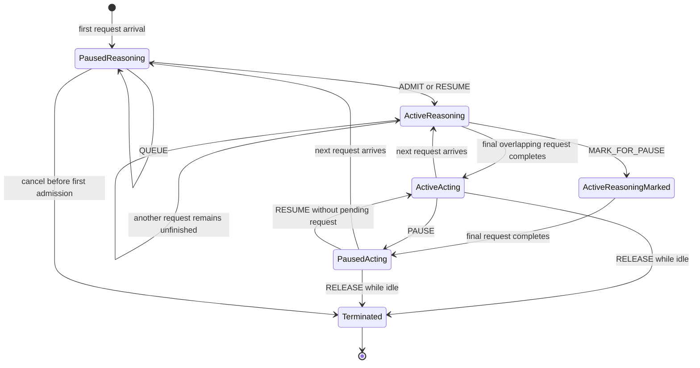

## Program state machine

## Purpose and boundary

The Program state machine is the host-neutral runtime contract between an adapter and a scheduling strategy.
`ProgramScheduler` owns live Program records, request retention, snapshot construction, transition validation, event
dispatch, and periodic scheduling. A strategy chooses transitions but cannot mutate runtime state directly.

This module does not define Progress-TTL scores, parse API protocols, execute native requests, discover backends, or
implement retries.

## Program identity and generation

`program_id` identifies a logical Program across request attempts. `ProgramRef(program_id, generation)` identifies one
exact live incarnation. Releasing and later rematerializing the same external ID increments its generation. Request
completion, cancellation, and strategy transitions addressed by an exact `ProgramRef` cannot mutate the replacement.
The optional lifecycle channel is weaker: it carries only `program_id`, so it rejects release while the current Program
has unfinished work but cannot correlate a delayed terminal signal with its originating generation.

`ProgramRegistry` owns the current record for each `program_id`, the last generation counter, task membership, and
blocking-parent indexes. It exposes immutable `ProgramView` values to strategies.

## Program-owned runtime fields

`RuntimeProgram` is the only mutable core record for one live Program generation. Its fields are runtime facts, not
Progress-TTL scores.

| Field | Meaning | Updated when |
| --- | --- | --- |
| `ref` | Exact `(program_id, generation)` identity. | Set on materialization; never changes within the generation. |
| `state` | Forwarding state: `ACTIVE`, `PAUSED`, or `TERMINATED`. | Changed only by accepted `ADMIT`, `RESUME`, `PAUSE`, or `RELEASE` transitions. |
| `status` | Demand state: `REASONING` or `ACTING`. | Set to reasoning on request arrival; set to acting after the last overlapping request completes or is cancelled. |
| `tokens` | Latest context, growth, shared-prefix, and optional physical cache observation. | Context is raised on arrival and finalized on completion; shared-prefix fields are refreshed only when their freshness deadline permits. |
| `backend_id` | Backend that owns an active Program. | Set by admit/resume; cleared by pause/release. |
| `task_id` | Stable grouping for related Programs. | Set at materialization or filled once from later compatible metadata; cannot change afterward. |
| `parent_program_id`, `blocks_parent` | Supplied parent relationship and whether the child blocks it. | Applied from compatible identity metadata; registry relationship indexes are updated atomically. |
| `blocked_on_child`, `blocking_children` | Derived live blocking-child state. | Recomputed when a blocking child is attached, detached, changed, or released. |
| `expected_resume` | Upstream expectation that another model request will follow. | Refreshed from identity metadata; it is a hint and does not itself change state. |
| `agent_role`, `spawn_reason` | Optional upstream diagnostic metadata. | Refreshed when later compatible identity metadata supplies a non-null value. |
| `step_count` | Number of completed model requests. | Incremented once by `record_completion()`. |
| `wait_started_at_monotonic_s` | Core scheduling wait timestamp exposed in `ProgramView`. | Reserved by the runtime model; Progress-TTL uses its own policy-specific wait timestamps described below. |
| `marked_for_pause` | Delayed pause requested for in-flight reasoning. | Set by `MARK_FOR_PAUSE`; cleared by admit/resume/pause and consumed after the last request completes. |
| `release_after_inflight` | Reserved flag for a terminal fact observed while work overlaps. | Present in the runtime record but not used by the current main-branch transition path. |

`ProgramTokenObservation` separates estimates from optional backend facts:

| Field | Meaning and update rule |
| --- | --- |
| `estimated_context_tokens` | Maximum known prompt/context on arrival, then trustworthy final total tokens on completion. |
| `shared_prefix_tokens` | Reusable prefix observed for the current segment; bounded by prompt length. |
| `shared_prefix_fresh_until_monotonic_s` | Deadline that prevents pause/resume churn from repeatedly refreshing the same prefix observation. |
| `actual_resident_tokens`, `actual_allocated_blocks`, `block_size_tokens` | Optional physical observations. The current vLLM bridge does not populate per-Program resident-block facts. |
| `shared_prefix_attribution`, `source`, `observed_at_monotonic_s` | Observation quality, source, and timestamp. |

The runtime also maintains request-scoped indexes outside `RuntimeProgram`: `_request_bindings` binds each `request_id`
to an exact Program generation and request token counters; `_program_requests` tracks overlapping unfinished requests;
`_last_request_finished_at` derives the next inter-request gap; and `_shared_prefix_freshness_anchor_at` anchors
freshness to Program entry or the latest accepted pause. These indexes are removed with request completion/cancellation
or Program release.

## Policy-owned Program factors

Scheduling-policy values do not belong in `RuntimeProgram`. `StrategyFactors` stores one global factor object and one
per-generation factor object under the same serialized mutation boundary. For Progress-TTL, `ProgressTTLProgramFactors`
contains:

| Group | Fields | Update points |
| --- | --- | --- |
| Current segment | `segment_served_rounds`, `segment_started_at_monotonic_s`, `segment_prompt_tokens`, `segment_completion_tokens`, `segment_first_request_pending`, `last_request_prompt_tokens`, `last_request_context_tokens`, `segment_share_tokens` | Reset on admit/resume; accumulated on completion; frozen and cleared on pause. The first-request flag prevents repeated same-segment cache observations from being treated as new shared reuse. |
| Lifetime progress | `lifetime_generated_tokens`, `rounds_since_ttl_pause`, `previous_ttl_seconds`, `last_inter_request_gap_seconds`, `is_evictable_after_min_rounds` | Updated on completion; used by privilege promotion, continuity estimation, and acting-TTL accounting. |
| Previous segment | `last_segment_served_rounds`, `last_segment_prompt_tokens`, `last_segment_completion_tokens` | Copied from the current segment on pause for diagnostics and capacity ordering. |
| Waiting and recency | `wait_started_at_monotonic_s`, `request_wait_started_at_monotonic_s`, `last_request_finished_at_monotonic_s`, `acting_since_monotonic_s` | Waiting timestamps are set when queued/paused and cleared on admit/resume; finish recency orders ordinary MRU resume; acting starts only after the final overlapping request completes. |
| Deadlines | `ttl_deadline_monotonic_s`, `ttl_expiry_observed`, `release_deadline_monotonic_s`, `force_resume_timeout_seconds`, `force_resume_deadline_monotonic_s` | Acting TTL is armed at idle completion; a dynamic force timeout is frozen for a pending waiter; pause arms release retention. |
| Placement history | `last_pause_at_monotonic_s`, `last_resume_at_monotonic_s`, `pause_reason`, `resume_reason` | Recorded only after the corresponding transition is accepted. |
| Bounded privilege | `is_privileged`, `privilege_reason`, `privilege_deadline_monotonic_s`, `privilege_ttl_expired` | Reconciled and changed by promotion, handoff, TTL expiry, capacity demotion, pause, and release. |

This split is normative: core fields describe what the Program is and what the runtime has committed; policy factors
describe values used to choose the next transition.

## Two independent dimensions

Program status describes demand for model service. Program state describes the scheduler's forwarding decision.

| Dimension | Value | Meaning |
| --- | --- | --- |
| Status | `REASONING` | The Program has model demand. This includes requests retained by AgentInfer, waiting in the host-native queue, or executing in the backend. |
| Status | `ACTING` | The Program has no unfinished model request and may be executing a tool or local work. |
| State | `ACTIVE` | Requests belonging to the Program may enter the host-native queue. |
| State | `PAUSED` | Requests remain retained until admission or resume. |
| State | `TERMINATED` | The exact generation has been released and removed from the live registry. |

`REASONING` does not mean “currently executing inference,” and `ACTING` does not imply either `ACTIVE` or `PAUSED`.

## Lifecycle overview



The diagram combines state and status only for readability. The implementation stores them as separate fields, and
`marked_for_pause` is a delayed-transition flag rather than a third state.

## Request lifecycle

`ProgramScheduler` exposes these adapter entry points:

| Entry point | Runtime action |
| --- | --- |
| `on_request_arrival()` | Validate a unique request ID, materialize or update the Program, set status to `REASONING`, retain the native object, and invoke immediate admission. |
| `on_stream_output()` | Monotonically update output-token progress without changing Program status. |
| `on_prefix_cache_observation()` | Update a due shared-prefix observation for the current segment without changing lifecycle state. |
| `on_request_completion()` | Remove the exact request binding, commit final token facts, update rolling events, and set status to `ACTING` only when no overlapping request remains. |
| `on_response_completion()` | Apply an optional terminal lifecycle fact only to an idle current generation. |
| `cancel_request()` | Remove a retained request and binding without fabricating a successful completion. |
| `schedule_cycle()` | Run due resume, capacity repair, and scheduled checks from one fresh backend observation. |

Arrival time is recorded before admission, so end-to-end request latency includes time retained in the RequestPool.

The main update sequence for one ordinary round is:

1. Arrival materializes or resolves the Program, updates its context estimate, marks it reasoning, records the request
   binding, and retains the native object before asking the strategy for admission.
2. Admit or resume changes only forwarding state and transfers every retained request for that Program to the host.
3. Stream output monotonically raises the request binding's output count; it does not change Program status.
4. Completion removes the request binding, commits final total tokens, increments `step_count`, updates policy rolling
   factors, and changes status to acting only when no overlapping request remains.
5. A due TTL or capacity decision pauses an idle Program immediately or marks reasoning work for pause after completion.
6. Terminal API evidence or a retention deadline releases only an idle exact generation and removes runtime indexes plus
   policy factors.

## RequestPool ownership

`RequestPool` is embedded in `ProgramScheduler`; it is not a second deployed service and does not add another Program
waiting state. Each entry stores one native retained object, its request ID, exact Program reference, arrival time,
status, and optional dispatch target.

The pool has two request states:

| State | Meaning |
| --- | --- |
| `WAITING` | AgentInfer still owns the request before host-native admission. |
| `ADMITTED` | A one-shot `request_id -> DispatchTarget` result has been committed and awaits adapter consumption. |

An adapter may associate the retained object with a coroutine, HTTP gate, or native engine request. Once
`consume_admitted()` removes it, ownership transfers to the host. Cancellation or timeout while retained must call
`cancel_request()` and remove the entry.

## Transition contract

Strategies submit `TransitionRequest` through a lock-scoped `TransitionController`. The runtime validates the exact
generation and current lifecycle before committing the change.

| Transition | Valid precondition | Effect |
| --- | --- | --- |
| `ADMIT` | `PAUSED` | Set `ACTIVE`, bind backend, clear delayed pause, and admit retained requests. |
| `QUEUE` | `PAUSED` | Keep the Program paused and expose it through the waiting view. |
| `RESUME` | `PAUSED` | Set `ACTIVE`, bind backend, clear delayed pause, and admit retained requests. |
| `PAUSE` | `ACTIVE + ACTING` | Set `PAUSED`, clear backend and delayed pause, and restart shared-prefix freshness. |
| `MARK_FOR_PAUSE` | `ACTIVE + REASONING` | Preserve current inference and pause after the last overlapping request completes. |
| `RELEASE` | No unfinished request | Mark terminated, remove registry indexes and policy sidecars, and invalidate the generation. |

A rejected transition returns `TransitionResult(applied=false, reason=...)` with no event. Callers may treat rejection
as a recoverable race or as an internal invariant violation; the runtime itself never forwards an invalid transition to
a backend.

## Snapshots and same-cycle decisions

`SchedulingSnapshot` is the complete immutable strategy read model for one hook invocation. It contains observation
time, backend ID, total KV capacity, optional native used and waiting token counts, immutable Program views, and the
ordered paused-Program view.

Policy-derived factors are passed separately because accepted transitions may update them during a cycle. After each
strategy phase, `ProgramScheduler` applies the accepted-transition ledger to the previous snapshot, producing the next
same-cycle view without rebuilding or re-sorting the registry. This protects already accepted decisions while avoiding
repeated hot-path view construction.

The cycle order is:

1. construct one snapshot;
2. notify the strategy that a cycle started;
3. schedule resumes;
4. advance the snapshot from accepted transitions;
5. repair capacity;
6. advance again and run due deadlines.

## Events and diagnostics

Every committed request or Program transition emits an immutable `SchedulingEvent` with a process-local sequence,
idempotency key, before/after state and status, stable reason, and typed scalar fields. Every Program-scoped event
carries the exact Program generation; `CAPACITY_OBSERVED` and `STRATEGY_FACTORS_CHANGED` are the only event kinds that
do not require a Program.

`StrategyDiagnostic` explains a calculation without pretending that it changed lifecycle state. Observability sinks may
log events and diagnostics, but logging is not part of the state machine and must not control decisions.

## Backend observation boundary

The runtime accepts logical KV-token capacity through `BackendPoolInfo`. Capacity belongs to the concrete `DpRankInfo`
that owns the scheduling queue:

| Field | Semantics |
| --- | --- |
| `total_hbm_kv_tokens` | Directly observed rank-local HBM capacity. |
| `used_hbm_kv_tokens` | Backend-observed usage for that DP rank. |
| `waiting_hbm_kv_tokens` | Estimated token demand already waiting in the native queue. |
| `total_dram_kv_tokens` / `total_ssd_kv_tokens` | Adapter-assigned per-rank quota, not a duplicated machine-wide total. |
| `total_remote_store_kv_tokens` | Optional pool shared by the complete backend list. |

The adapter discovers and aggregates these facts. The runtime does not infer device topology or perform cross-rank load
balancing.

## Concurrency and failures

`ProgramScheduler` is synchronous. Its adapter must serialize request callbacks, snapshot construction, factor updates,
and transitions under one mutation boundary. Host-specific futures, locks, HTTP primitives, and engine request types
remain outside the scheduling package.

A client retry is a new arrival with a new `request_id`. Completion reports progress and lifecycle, not success or
retryability. Missing API terminal signals are tolerated by strategy-owned cleanup timers.

## Normative invariants

- **PSM-INV-001:** One request attempt is owned by either RequestPool or the host-native queue, never both.
- **PSM-INV-002:** Every Program mutation targets an exact `(program_id, generation)` reference.
- **PSM-INV-003:** Status and state remain independent; `REASONING` includes retained, native-waiting, and executing
  requests.
- **PSM-INV-004:** Strategies consume immutable snapshots and request changes only through typed transitions.
- **PSM-INV-005:** An in-flight reasoning Program is marked for delayed pause and is not immediately paused.
- **PSM-INV-006:** Release cannot interrupt an unfinished request.
- **PSM-INV-007:** Capacity fields use logical KV-token slots owned by the DP-rank scheduling domain.

## Safe changes and validation

Changes to lifecycle preconditions, request ownership, generation handling, snapshot advancement, or event schemas
require focused contract tests.

```bash
pytest -q \
  tests/scheduling/test_contracts.py \
  tests/scheduling/test_program_runtime.py \
  tests/scheduling/test_strategy_contracts.py
```
