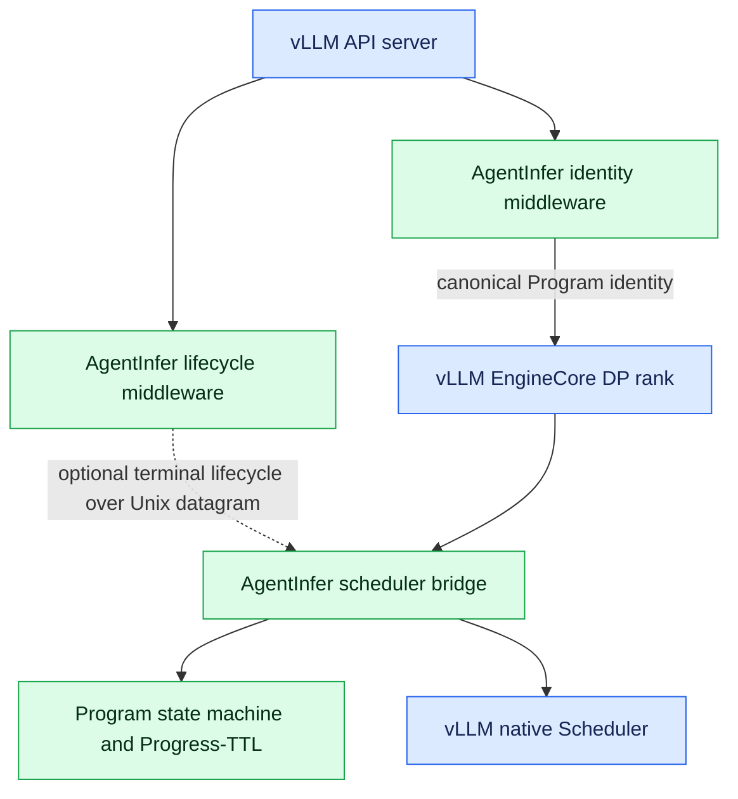

## vLLM runtime integration

## Purpose and boundary

AgentInfer integrates Program scheduling into vLLM V1 without replacing vLLM's token scheduler. AgentInfer may retain an
agent request before native admission, but vLLM still owns its waiting queue, token budget, batching, preemption, KV
allocation, model execution, and output processing after admission.

The integration lives under `agentinfer.agentcache.core` because it adapts vLLM request and scheduler objects.
Host-neutral identity contracts, the Program state machine, and Progress-TTL remain under `agentinfer.scheduling`.

## Requirements

- Install AgentInfer in the same Python environment as vLLM.
- Use the async bridge with `--async-scheduling`, or the sync bridge with `--no-async-scheduling`.
- Enable prefix caching when Progress-TTL should observe reusable prefixes.
- Provide Program identity through canonical request metadata or the identity middleware.
- Use a vLLM version whose V1 scheduler interfaces match the AgentInfer release under test.

## Start a server

Install AgentInfer into the same activated environment that provides the compatible vLLM build:

```bash
source /path/to/vllm/.venv/bin/activate
python -m pip install -e /path/to/AgentInfer
```

The recommended async configuration is:

```bash
export AGENTCACHE_VLLM_LIFECYCLE_SOCKET=/tmp/agentinfer-vllm-lifecycle.sock

vllm serve MODEL \
  --async-scheduling \
  --scheduler-cls agentinfer.agentcache.core.scheduler.AgentCacheAsyncSchedulerBridge \
  --middleware agentinfer.agentcache.core.api_adapter.AgentCacheIdentityMiddleware \
  --middleware agentinfer.agentcache.core.api_adapter.AgentCacheLifecycleMiddleware \
  --enable-prefix-caching \
  --enable-prompt-tokens-details \
  --additional-config '{
    "agentcache": {
      "controller_factory": "agentinfer.agentcache.core.factory.build_progress_ttl_controller",
      "progress_ttl": {
        "mode": "on"
      },
      "observability": {
        "enabled": true,
        "log_interval_seconds": 5
      }
    }
  }'
```

Add model, parallelism, memory, tool-parser, and API options required by the target deployment.
`AgentCacheAsyncSchedulerBridge` rejects configurations where async scheduling is disabled. For a synchronous
deployment, pass `--no-async-scheduling` and select
`agentinfer.agentcache.core.scheduler.AgentCacheSyncSchedulerBridge`. The negative flag must be explicit because vLLM
0.23.0 may auto-enable async scheduling when the option is unset.

The lifecycle middleware is optional. If it is omitted, also omit `AGENTCACHE_VLLM_LIFECYCLE_SOCKET`; acting TTL and
paused-Program TTL remain fallback cleanup paths. The identity middleware is required for framework headers,
`agent_hint`, and `/v1/messages`; OpenAI-compatible callers that already send canonical `vllm_xargs.agentic_context` can
reach EngineCore without body normalization.

The command-line options added for this integration have distinct responsibilities:

| Option | Responsibility |
| --- | --- |
| `--async-scheduling` | Enables vLLM's native asynchronous scheduling path. It must match the async bridge. |
| `--no-async-scheduling` | Explicitly disables vLLM async scheduling. It must match the sync bridge. |
| `--scheduler-cls ...AgentCacheAsyncSchedulerBridge` | Wraps native `AsyncScheduler` with Program admission hooks while preserving native token scheduling. |
| `--middleware ...AgentCacheIdentityMiddleware` | Normalizes framework headers or `agent_hint`, and bridges Anthropic Messages identity into internal `vllm_xargs.agentic_context`. |
| `--middleware ...AgentCacheLifecycleMiddleware` | Optionally parses final API response semantics and sends terminal lifecycle facts to the selected EngineCore rank. |
| `--enable-prefix-caching` | Enables the vLLM prefix cache whose reusable-prefix boundary is observed by Progress-TTL. |
| `--enable-prompt-tokens-details` | Makes prompt/cache token evidence available to API clients and benchmark tooling; it does not select the policy. |
| `--additional-config` | Supplies the `agentcache` adapter, policy, and observability namespaces. |
| `AGENTCACHE_VLLM_LIFECYCLE_SOCKET` | Selects the API-side Unix datagram base path; the receiver uses a `.dpN` suffix. It is needed only with lifecycle middleware. |

Do not select legacy `agentinfer.agentcache.core.scheduler.AgentAwareScheduler` for this configuration. It replaces
vLLM's waiting queue and is not the Progress-TTL integration path. A native comparison whose environment imports
AgentInfer should explicitly select `vllm.v1.core.sched.async_scheduler.AsyncScheduler`.

## Architecture



Blue nodes are native vLLM components. Green nodes are AgentInfer components.

## Relationship to native vLLM async scheduling

`AgentCacheAsyncSchedulerBridge` extends vLLM's native `AsyncScheduler`; it does not replace vLLM's token-level
scheduling algorithm. Each call performs an AgentInfer pre-schedule hook, calls `super().schedule()` exactly once, then
records computed-prefix observations from the returned native scheduling output. Once a request enters vLLM's waiting
queue, native vLLM still owns token-budget allocation, continuous batching, KV-block allocation, preemption, model
execution, and output processing.

AgentInfer changes the request set and order visible to the native scheduler. `add_request()` may retain tracked agentic
work in RequestPool, and a later Program decision transfers an admitted request to the native waiting queue exactly once.
Progress-TTL therefore controls **when** a Program becomes eligible for native scheduling, while vLLM controls **how**
eligible requests share each model-execution step. Compatibility traffic without recognized Program identity bypasses
RequestPool and follows native admission directly.

The wrapper has non-zero CPU cost. On the common no-cycle path, it checks deadlines and the O(1) `has_programs` flag
before constructing Program views; the isolated 64-Program gate benchmark is approximately 0.2 microseconds. This is a
component measurement, not the total `schedule()` wrapper cost. A due cycle constructs a snapshot and evaluates live
Programs, while post-schedule prefix observation scans newly scheduled tracked requests, so those paths scale with the
corresponding Program or request count. AgentInfer does not claim a concurrency-independent or zero-overhead wrapper.

### CPU cost by vLLM execution path

Here a **path** means the vLLM lifecycle method in which AgentInfer executes. Let `N` be live Programs, `W` paused
reasoning Programs with pending requests, `A` active Programs, `B` requests already waiting in native vLLM, `S` newly
scheduled native requests, `O` outputs returned by one model step, and `F` requests completed by that step.

| vLLM execution path | AgentInfer work | Plugin-side complexity | Primary performance risk |
| --- | --- | --- | --- |
| `add_request()` -> `on_request_arrival()` | Parse identity, materialize or update the Program, construct a snapshot, and make the immediate admission decision. | Compatibility traffic without identity adds `O(1)`. A tracked request is normally `O(N log N)` because snapshot construction sorts all live Programs; admission then performs linear active, waiting, relationship, capacity, and privilege scans. | Runs before the request enters native waiting. Excess cost primarily increases admission delay and TTFT; because it executes in EngineCore, a very slow arrival hook can also postpone later engine-loop work. |
| `schedule()`, no cycle due | Check lifecycle input, deadline, periodic time, and O(1) `has_programs`; call native `super().schedule()`; observe `S` newly scheduled requests. | `O(1 + S)` beyond native scheduling. It constructs no Program snapshot and performs no Program sort. | This is the every-step async hot path. Its pre- and post-hooks must remain shorter than the available CPU/GPU overlap budget. |
| `schedule()`, Program cycle due | Read native capacity, including an `O(B)` waiting-token scan; build snapshots; run resume, capacity repair/pause, and any due TTL/release check before returning the native schedule result. | `O(B + N log N + C_resume + C_pause + C_deadline + S)`. The policy terms are expanded below. | This is the path most likely to create a GPU bubble. Under async scheduling, if AgentInfer plus native scheduling takes longer than the concurrent GPU step, dispatch of the next step is delayed. |
| `schedule()`, completion-triggered prefix refresh | Before native scheduling, scan retained requests and query vLLM's read-only longest-cache-hit lookup for candidates whose freshness expired. | `O(R + sum(H_i))`, where `R` is retained requests and `H_i` is the vLLM prefix lookup cost for each queried candidate. | Runs before `super().schedule()` and therefore shares the same GPU-overlap risk as a due Program cycle. |
| `update_from_output()` -> `on_request_completion()` | After native output state is committed, publish stream progress; for each completed tracked request, update rolling factors, assign TTL, construct current Program views, and evaluate completion-time pause. | `O(O + F * N log N)` in the current implementation. TTL candidate search is bounded by a fixed 32-point grid. | Runs after model output becomes available. Excess cost delays final-output processing and request latency, and may delay the next EngineCore scheduling iteration. |
| Explicit `finish_requests()` | Cancel retained attempts, scan native tracked requests for final token counts, call native finish, and apply completion bookkeeping to matched tracked requests. | `O(R + M + X * N log N)`, where `R` is selected retained attempts, `M` is native requests scanned, and `X` is tracked attempts actually finished. | Primarily affects abort, cancellation, and shutdown latency; normal successful completion uses `update_from_output()`. |

Lifecycle datagrams are drained from `add_request()` and the pre-`schedule()` hook. Their socket receive is non-blocking,
but each accepted terminal release refreshes the strategy deadline and may scan up to `N` factors; this cost therefore
belongs to whichever of those two vLLM paths drains the signal.

Within the due `schedule()` path, the core policy costs are:

- **Resume:** reconciling privilege, sorting `W` candidates, and recomputing growth reserve against `A` active Programs
  costs `C_resume = O(N + P log P + W log W + W * A + K_resume * N)`. The last term is deadline refresh after accepted
  transitions. If capacity-deficient resumes reclaim `V` acting Programs, exact least-over-release selection adds
  `O(Q * V * R_sum)` dynamic-programming state updates for `Q <= W` candidates. `R_sum` can approach
  `min(2^V, deficit_tokens)`, making this a conditional capacity-pressure slow path.
- **Capacity repair and pause:** scoring and sorting ordinary victims costs
  `C_pause = O(N log N + K_pause * N)`. Filling `L` privilege slots currently adds up to `O(L * N^2)` because candidate
  eligibility rescans live Programs; its theoretical bound is `O(N^3)` if `L` scales with `N`, although rank capacity
  normally keeps `L` small.
- **TTL and release deadlines:** scanning ordinary acting and paused Programs is linear. If `D` due privileged acting
  Programs each search the same-task handoff candidates, `C_deadline = O(N + D * N + K_deadline * N)`, with an `O(N^2)`
  worst case.

One entered Program cycle builds one initial snapshot, advances it after resume, and may advance it again before deadline
handling. Each advancement is `O(N + K)`. Without acting reclaim or repeated privilege promotion, the due-cycle policy
cost is at most quadratic in live Programs; the no-cycle `schedule()` path remains `O(1 + S)`. These are algorithmic
bounds, not latency measurements of the complete wrapper.

`auto` mode limits policy intervention when continuity is unsuitable. It starts with transitions off and waits for a
complete 100-interval continuity window. Posterior utility hysteresis enables transitions only when measured TTL benefit
reaches the configured enable threshold and disables them when it falls below the disable threshold. While transitions
are off, new reasoning requests are admitted directly, paused reasoning requests are activated without capacity checks,
and TTL expiry updates theoretical statistics without pausing Programs. Identity handling, lightweight gates, and
statistics collection remain active, but Progress-TTL does not intentionally retain or reorder requests.

## Integration points

| vLLM point | AgentInfer action | Native behavior preserved |
| --- | --- | --- |
| `add_request()` | Parse canonical identity, call `on_request_arrival()`, and retain a request when admission is deferred. | Request construction and immediate native admission for compatibility traffic. |
| Before `schedule()` | Check deadlines and the O(1) `has_programs` flag before constructing views; run a Program scheduling cycle only when due. | Native token scheduling runs unchanged afterward. |
| After `schedule()` | Record computed-prefix information for admitted tracked requests. | Native prefix-cache lookup and scheduler output. |
| After `update_from_output()` | Report token progress and completion after vLLM has updated its own request and KV state. | Native async output invariants and response construction. |
| `finish_requests()` | Cancel retained requests locally or delegate admitted requests to native finish, then clean the Program binding. | Native abort, finish, and preemption behavior. |
| Unfinished count | Add retained RequestPool entries to vLLM's native unfinished count. | EngineCore liveness and shutdown semantics. |

When AgentInfer releases a retained request, the bridge adds it to the native waiting queue exactly once. It preserves
the original arrival timestamp in the emitted vLLM queue event, so externally observed queue time includes RequestPool
residence without changing native scheduling decisions.

## Identity transport

The identity middleware handles POST requests on `/v1/chat/completions`, `/chat/completions`, `/v1/messages`, and
`/messages`. Other methods and paths pass through without identity adaptation.

The shared parser accepts these sources in precedence order:

1. `vllm_xargs.agentic_context`, the recommended canonical contract;
2. `agent_hint`, the supported session-oriented framework contract;
3. known framework headers.

The middleware recognizes:

| Source | Session/task mapping | Program mapping |
| --- | --- | --- |
| Claude Code | `x-claude-code-session-id` supplies session and default task. | Missing `x-claude-code-agent-id` means the lead; a present agent ID creates a subagent Program. `x-claude-code-parent-agent-id` supplies the parent when present. |
| Codex/OpenCode-style headers | `session-id` supplies the session and `thread-id` distinguishes the agent. | The normalized task and agent components form `program_id`. |
| Generic session header | `x-session-id` supplies the session. | The session becomes one lead Program. |
| `agent_hint` | `session_id` is retained as the session and `task_id` remains empty. | `session_id` is also used as `program_id`; `blocks_parent` defaults to true and an explicit `expected_resume` takes precedence. |

Stock vLLM trace-header propagation is not an identity transport. The identity middleware reads the API request and
writes only the normalized result to `vllm_xargs.agentic_context`. For `/v1/messages`, where the public Anthropic
request schema has no `vllm_xargs` field, a narrow conversion hook carries middleware-owned metadata into vLLM's
internal Chat request.

If no supported identity is present, the bridge sends the request directly to native vLLM and does not create a
Program. If a recognized identity contract is malformed, the middleware returns an HTTP 400 `invalid_request_error`
JSON response before the request reaches EngineCore.

## Optional terminal lifecycle

Only the API layer can observe the final response after endpoint-specific tool-call parsing.
`AgentCacheLifecycleMiddleware` therefore extracts a protocol-neutral `CONTINUE`, `TERMINAL`, or `UNKNOWN` fact from
OpenAI Chat or Anthropic Messages output and sends it through a non-blocking Unix datagram socket. It does not modify
response bytes.

EngineCore polls the socket at existing adapter entry points. Headerless single-DP traffic defaults to rank 0. In a
multi-DP deployment, the upstream API/router must provide `X-data-parallel-rank` so the signal reaches the `.dpN` socket
owned by the selected EngineCore rank.

Failure to deliver a lifecycle datagram is logged and does not fail the request. Without a reliable terminal signal,
Progress-TTL eventually releases stale state through its TTL fallbacks.

## Capacity accounting

Each EngineCore derives its own DP rank from `parallel_config.data_parallel_index` and reads local HBM capacity as
`kv_cache_config.num_blocks * block_size`. The resolved `block_size` already includes context-parallel effects such as
DCP and PCP, so the bridge must not multiply capacity again. `tensor_parallel_size` is not a DP-rank count, and
`additional_config.agentcache.num_ranks` is rejected.

`kv_cache_manager.usage()` reports native running usage. The bridge separately estimates token demand already waiting in
native vLLM queues. Program scheduling combines these backend facts with retained and acting Program estimates; it does
not reinterpret native waiting work as newly available capacity.

The current bridge supplies only rank-local HBM capacity and usage to Progress-TTL. `DpRankInfo` can represent
adapter-partitioned DRAM and SSD quotas, but the vLLM bridge does not currently discover those capacities and the
main-branch strategy does not use them for tier-aware resume or reload decisions.

Cross-rank load balancing and cache-affinity routing are outside this bridge. An upstream router selects the DP rank,
and each EngineCore independently schedules the queue it owns.

## Configuration

All integration settings are under `additional_config.agentcache`.

| Setting | Default | Purpose |
| --- | --- | --- |
| `controller_factory` | unset | Enables Program scheduling by importing an explicit controller factory. Without it, the bridge is native pass-through. |
| `backend_id` | `vllm-local` | Names the local backend in dispatch results. |
| `lifecycle_socket_path` | environment value | Overrides the EngineCore receiver's lifecycle socket base path. The API middleware still reads `AGENTCACHE_VLLM_LIFECYCLE_SOCKET`. |
| `schedule_interval_seconds` | `1.0` | Minimum interval between ordinary Program scheduling cycles; due TTL deadlines can trigger an earlier cycle. |
| `expected_reasoning_agent_nums` | unset | Optional workload description for the DP rank; current Progress-TTL decisions do not consume it. |
| `observability.enabled` | `false` | Enables decision events and periodic Progress-TTL diagnostics. |
| `observability.log_interval_seconds` | `5.0` | Limits periodic diagnostic frequency without changing scheduling frequency. |

Progress-TTL settings are under `additional_config.agentcache.progress_ttl`.

### Core workload-tuning settings

| Setting | Default | Purpose |
| --- | --- | --- |
| `ttl_min_seconds` / `ttl_max_seconds` | `0.05` / `32` | Defines the acting-TTL search interval before impact and utility caps. |
| `ttl_prefill_model_intercept_seconds` | `0.042935` | Constant term of the deployment-calibrated quadratic cold-prefill model for positive uncached input. |
| `ttl_prefill_model_linear_seconds_per_1k_tokens` | `0.080027` | Linear coefficient of the quadratic cold-prefill model. |
| `ttl_prefill_model_quadratic_seconds_per_1k_tokens_squared` | `0.00220962` | Quadratic coefficient that captures increasing prefill cost at long context. |
| `ttl_decode_throughput_alpha` | `0.15` | Fraction of normal decode throughput retained during prefill; it is generally low for mixed execution and `1` for fully separated execution. |
| `privileged_max_context_tokens` | `262144` | Converts rank-local KV capacity into a bounded number of full-context privilege slots. |

See [Core tuning parameters](progress_ttl_scheduling.md#core-tuning-parameters) for formulas and measurement guidance.

---

### Other Progress-TTL settings

| Setting | Default | Purpose |
| --- | --- | --- |
| `mode` | `on` | Selects `on`, `off`, or posterior-utility-controlled `auto`. |
| `target_max_segment_rounds` | `14` | Caps growth-reserve protection and allows queue pressure to end an overlong segment. |
| `ttl_max_cache_miss_impact_ratio` | `1.0` | Caps TTL as a fraction of estimated cold-prefill impact. |
| `auto_enable_utility_seconds` / `auto_disable_utility_seconds` | `20` / `5` | Provides hysteresis for auto-mode activation. |
| `shared_prefix_freshness_warmup_seconds` | `100` | Uses a conservative freshness interval before rolling statistics mature. |
| `shared_prefix_freshness_kv_turnovers` | `2.0` | Refreshes a shared-prefix observation after the estimated KV pool has turned over this many times. |
| `resume_capacity_ratio` | `1.0` | Limits capacity used by admission and resume decisions. |
| `resume_order` | `mru` | Orders ordinary paused reasoning Programs by recent completion (`mru`) or current-request wait start (`fcfs`); forced and privileged tiers remain higher. |
| `resume_reclaim_acting_programs` | `true` | Allows a periodic resume decision to reclaim capacity from active acting Programs. |
| `pause_capacity_ratio` | `1.0` | Defines the capacity-repair threshold. |
| `privileged_ttl_seconds` | `5.0` | Bounds one privilege assignment before reconciliation may expire it. |
| `use_fixed_input_token_growth` | `false` | Uses a supplied per-round growth value instead of rolling growth statistics. |
| `fixed_input_token_growth_per_round` | `1024` | Growth used when fixed-growth mode is enabled. |
| `enable_batch_gain_admission` | `true` | Allows immediate-capacity admission when predicted batch gain covers recovery and continuity loss even though growth reserve does not fit. |
| `decode_step_fixed_seconds` | calibrated constant | Fixed time in one modeled decode step, independent of batch size and context length. |
| `decode_step_seconds_per_request` | calibrated constant | Additional decode-step time per concurrently running request; its reciprocal bounds the model's asymptotic throughput. |
| `decode_step_seconds_per_context_token` | calibrated constant | Additional decode-step time per logical context token across the running batch. |
| `force_resume_timeout_scale` | `3.0` | Scales estimated work ahead divided by recent request throughput when freezing a force deadline. |
| `force_resume_timeout_min_seconds` / `force_resume_timeout_max_seconds` | `30` / `300` | Bounds the adaptive force-resume timeout; an incomplete throughput window uses the maximum. |
| `paused_program_ttl_seconds` | `1800` | Releases a stale paused Program after this duration. |

`decode_buffer_tokens` is fixed at 100 by the vLLM factory and is not an operator setting. Unknown fields, removed
fields, and implementation-fixed values are rejected instead of being silently ignored.

### Configuration migration

Deployments upgrading from the previous Progress-TTL configuration must update
`additional_config.agentcache.progress_ttl` before startup. Removed names are rejected instead of becoming no-ops:

- Replace `ttl_prefill_seconds_per_1k_uncached_tokens` with the intercept, linear, and quadratic
  `ttl_prefill_model_*` coefficients.
- Replace `force_resume_timeout_seconds` with `force_resume_timeout_scale` and the minimum and maximum adaptive
  timeout settings.
- The `ttl_min_seconds` / `ttl_max_seconds` defaults change from `10` / `120` to `0.05` / `32`; explicit existing
  values remain valid.
- The `resume_capacity_ratio` default changes from `0.95` to `1.0`; an explicit existing value remains valid.
- Remove `target_min_segment_rounds`, `privileged_lookahead_rounds`, and `pause_capacity_lookahead_rounds`.
- Remove `resume_fairness_weight` and `resume_resource_penalty_weight`; use `resume_order=mru` or `fcfs`.
- Remove `capacity_safety_margin_tokens`, `ttl_impact_multiplier`, and `uncached_ratio_default`.
- Remove `decode_buffer_tokens` from startup configuration; the vLLM factory fixes it at 100 tokens.

New optional controls include `privileged_ttl_seconds`, `enable_batch_gain_admission`, the three `decode_step_*`
coefficients, and adaptive force-resume settings. Omitting them uses documented defaults.

## Logging

The bridge and middleware attach AgentInfer loggers to vLLM's existing logging configuration without replacing native
handlers, levels, or access logs. No custom `VLLM_LOGGING_CONFIG_PATH` is required for correctness. Enable
`agentcache.observability` for policy diagnostics; HTTP access-log visibility remains controlled by vLLM's own logging
options.

## Normative invariants

- **VI-INV-001:** A retained request enters the native vLLM waiting queue at most once.
- **VI-INV-002:** Native vLLM scheduling, KV allocation, output update, and finish logic run in their original order.
- **VI-INV-003:** A non-due AgentInfer check does not construct Program views or sort Programs on the vLLM schedule hot
  path.
- **VI-INV-004:** Requests without Program identity and deployments without a controller factory preserve native
  pass-through behavior.
- **VI-INV-005:** API lifecycle delivery is optional, non-blocking, and cannot fail the served request.
- **VI-INV-006:** DP-rank identity comes from EngineCore parallel configuration; TP size and obsolete `num_ranks`
  configuration do not participate.
- **VI-INV-007:** Context-parallel factors already represented by vLLM's resolved block size are not applied a second
  time.

## Validation

Run focused integration tests with:

```bash
pytest -q tests/agentcache/core tests/scheduling
```

For performance-sensitive changes, compare native vLLM and AgentInfer with the same model, task list, concurrency,
sampling parameters, and complete backend command. Verify request ownership, queue-time accounting, cache-hit behavior,
throughput, TTFT, and end-to-end latency.

## Compatibility notes

The bridge extends vLLM scheduler classes because vLLM does not yet expose a stable admission-controller plugin
boundary. Changes to vLLM constructor arguments, request fields, output placeholders, queue events, or KV-manager APIs
require an adapter compatibility review. The host-neutral scheduling package must not absorb version-specific vLLM
branches.
