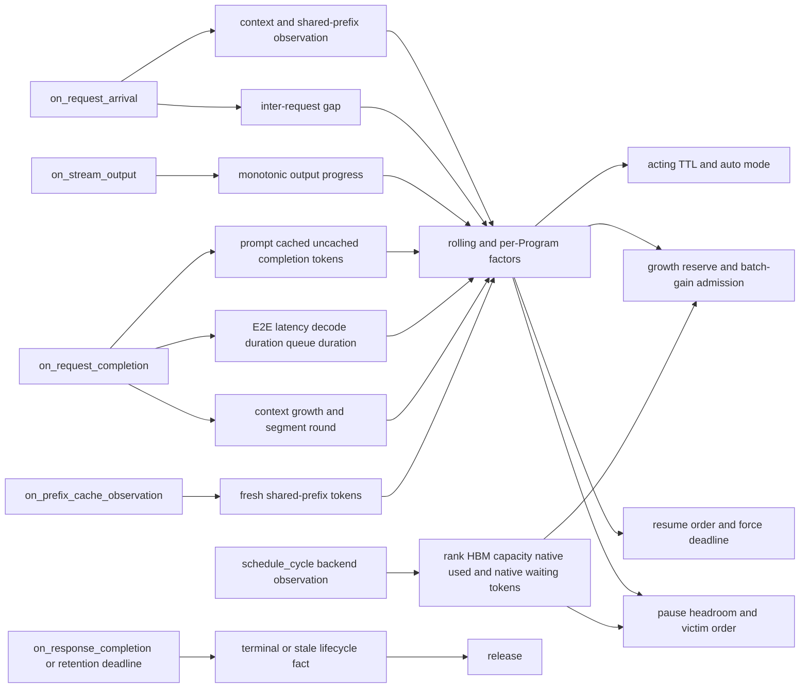

## Progress-TTL scheduling

## Purpose and boundary

Progress-TTL is AgentInfer's Program scheduling policy for cache-constrained agent workloads. It treats consecutive
`LLM -> tool call -> LLM` rounds as one Program, retains reusable HBM KV across short tool calls when the predicted
saving exceeds the wait cost, reserves bounded context growth for continuous execution, and repairs logical capacity
before the active set overfills one EngineCore DP rank.

The policy changes when a Program may enter vLLM's native waiting queue. It does not replace vLLM's token-level
scheduler, allocate KV blocks, execute requests, perform cross-DP routing, or estimate DRAM/SSD residency and reload
cost.

### Suitable workloads

| Dimension | Suitable | Usually unsuitable |
| --- | --- | --- |
| Agent continuity | Short intervals dominate the tool-call intervals between consecutive model requests. | Most tool calls are long. |
| Load pressure | Concurrent contexts cause visible HBM eviction and low native prefix-cache hit. | Active contexts fit in HBM without meaningful eviction. |
| Reuse value | A growing context has material cold-prefill cost relative to the tool-call interval. | Contexts are small or successive requests have little reusable prefix. |

### How Progress-TTL helps

1. An acting TTL protects a Program across a short tool call by preventing requests that would exceed protected HBM
   capacity from entering the backend.
2. A segment records continuous service between admission or resume and pause. Its completed rounds drive the
   workload-derived growth reserve, pause priority, and adaptive force-resume bound.
3. Admission may consume growth reserve only when the estimated batch-throughput gain covers both candidate recovery
   cost and continuity lost by active Programs.
4. Resume uses forced, privileged, and ordinary tiers. Ordinary ordering favors recent cache locality, while a bounded
   dynamic force deadline prevents starvation.

## Program segments and policy factors

A segment begins at admission or resume, counts cache-continuous completed rounds, accumulates prompt and completion
tokens, and ends at pause. A round is continuous when the first context has no predecessor or its local HBM hit exceeds
90% of the previous context. Program lifecycle facts remain in the core state machine; values used only for decisions
remain in `ProgressTTLFactors`.

| Scope | Maintained values |
| --- | --- |
| Global rolling factors | Prompt, shared-prefix, uncached-prompt, completion, request latency, decode duration, scheduler-queue duration, active/waiting counts, context growth, same-Program interval, TTL-pause segment length, and continuity utility. |
| Per-Program factors | Current and previous segment progress, request wait start, acting start, TTL/release/force-resume deadlines, last request finish, shared-prefix observation, and bounded privilege. |

Request and continuity windows each retain 100 samples. Ordinary request averages update after 50 samples. Growth
lookahead and adaptive continuity require a complete 100-sample window. Invalid, negative, reset-like, or excessively
large context-growth observations are excluded from the corresponding aggregate.

## External observations and decision flow



The mapping is normative at the level of information ownership: adapters supply observations, rolling statistics
derive workload factors, and the strategy alone converts those factors into typed transitions.

| Entry point | Observation recorded | Decisions affected |
| --- | --- | --- |
| `on_request_arrival()` | Context estimate, fresh shared prefix, arrival time, and previous completion-to-arrival gap. | Immediate admission, required capacity, TTL posterior sample, ordinary resume recency, and force deadline initialization. |
| `on_stream_output()` | Monotonic output-token count. | Final completion/context accounting. |
| `on_request_completion()` | Final prompt, total/local cached, first-round ref-count-zero, completion, latency, decode, RequestPool queue, context growth, and cache-continuous round. | Quadratic cold-prefill impact, TTL fit, auto mode, growth reserve, batch gain, pause headroom, shared-prefix freshness, and dynamic force resume. |
| `on_prefix_cache_observation()` | Fresh reusable prefix for a new or resumed segment. | Private capacity, cold-prefill impact, and batch-recovery cost. |
| `schedule_cycle()` | Rank-local HBM capacity, native running usage, and native waiting demand. | Admission/resume capacity and capacity repair. |
| `on_response_completion()` or retention deadline | Optional terminal evidence or stale retention. | Release of an idle Program generation. |

## Scheduling paths and cost boundary

| Path | Work | User-visible risk |
| --- | --- | --- |
| Request arrival | Materialize/update one Program, take one snapshot, evaluate admission, and retain or dispatch the request. | Excess cost adds to TTFT. |
| Stream output | Update one request binding monotonically. | Excess cost adds to streaming latency. |
| Request completion | Commit one binding, update bounded rolling windows, arm TTL, and apply delayed pause/release. | Excess cost adds to request latency. |
| Ordinary `schedule()` gate | Check due deadlines, the periodic timestamp, retained-request count, dirty bit, and O(1) `has_programs`. | If slower than an asynchronous GPU step, it can reduce GPU issue frequency. |
| Due scheduling cycle | Build/sort one snapshot, resume waiters, repair capacity, and process due deadlines. | Slow cycles can delay the next model step. |

Let `N` be live Programs, `W` paused reasoning Programs, and `A` active Programs. The non-due `schedule()` gate is
`O(1)`. A due cycle builds and sorts the snapshot in `O(N log N)`, sorts resume candidates in `O(W log W)`, and sorts
capacity victims in at most `O(A log A)` per repair selection. Privilege reconciliation and capacity scans are linear
in `N`. The policy avoids constructing Program views on a non-due schedule step.

## Capacity accounting

For Program `p`, private logical occupancy and immediate request demand are the same quantity:

```text
private_tokens(p) = max(context_tokens(p) - shared_prefix_tokens(p), 0)
required_tokens(p) = private_tokens(p) + decode_buffer_tokens
```

`decode_buffer_tokens` is an implementation-fixed 100-token allowance. There is no next-round host hint in the contract.

When native usage is available:

```text
used_tokens = native_used_kv_tokens + active_acting_reserved_tokens + native_waiting_kv_tokens
```

`native_used_kv_tokens` covers active reasoning work already running in vLLM. `native_waiting_kv_tokens` covers full
request contexts already admitted to native waiting and is intentionally not reduced by a shared-prefix estimate
because native compute is already saturated when that queue exists. `active_acting_reserved_tokens` is the sum of
`required_tokens(p)` for active acting Programs; this component subtracts each Program's observed shared prefix because
only private retained KV is charged. Together the three terms approximate all active Program demand plus work already
admitted to vLLM.

If native usage is unavailable:

```text
used_tokens = sum(required_tokens(p) for active Programs on this backend)
```

For capacity ratio `r`:

```text
remaining_tokens(r) = floor(total_kv_tokens * r) - used_tokens
```

Admission and resume use `resume_capacity_ratio`; repair uses `pause_capacity_ratio`.

## Continuous-growth reserve

The rolling growth sample for a completed round is the positive increase in total context from the Program's preceding
completed round. It estimates growth of a continuously served Program, not total uncached prompt or future LRU churn.
The separate HBM churn sample is local HBM miss plus completion tokens and, only on the first request of a segment,
local hit blocks whose pre-allocation reference count was zero. The last term captures blocks moved back to the MRU side
without repeatedly charging the same Program on later rounds.

Before the request window is complete:

```text
target_growth_rounds = 0
```

After the window is complete:

```text
estimated_continuity_rounds = max(1, ceil(2 * avg_rounds_since_ttl_pause))
target_growth_rounds = min(target_max_segment_rounds,
                           estimated_continuity_rounds)
```

The reserve shared by admission and resume is:

```text
remaining_rounds = target_growth_rounds
                 + sum(max(target_growth_rounds - segment_served_rounds(p), 0)
                       for active Program p other than candidate)

reserve_tokens = ceil(growth_tokens_per_round * remaining_rounds)
```

The candidate starts a fresh segment and contributes the full target. Each active Program contributes only unserved
target rounds. The maximum-segment limit caps both the candidate reserve and every active Program's remaining reserve,
because queue pressure may pause a Program after that many rounds. `growth_tokens_per_round` uses the filtered rolling
mean unless fixed-growth mode is enabled.

## Admission and resume

Admission applies this order:

1. an already active Program remains admitted;
2. an eligible privileged relationship handoff may bypass ordinary waiting and capacity checks;
3. an existing waiting Program, or any older waiting Program, keeps queue precedence;
4. unknown capacity queues the candidate;
5. if `remaining_tokens >= required_tokens + reserve_tokens`, admit;
6. if immediate required capacity fits but reserve does not, admit only when batch gain covers recovery and lost continuity;
7. otherwise queue.

Periodic resume considers only `PAUSED + REASONING` Programs. Resume candidates are partitioned into these tiers:

1. **Forced:** the pending request reached its frozen adaptive force deadline; resume bypasses capacity projection.
2. **Privileged:** a bounded privileged Program resumes before ordinary candidates.
3. **Ordinary:** order by `resume_order`; MRU favors the most recently completed Program and FCFS favors the oldest
   current request wait.

Ordinary candidates use the same capacity and reserve tests as admission. A privileged resume is an explicit capacity
bypass. If only the reserve fails for an ordinary candidate, the same batch-gain test may admit it. When
`resume_reclaim_acting_programs` is enabled, periodic resume may pause non-privileged active acting victims and retry the
capacity projection; request arrival does not run this reclaim path.

The dynamic force timeout is frozen when a request starts waiting:

```text
continuity_factor = min(target_max_segment_rounds,
                        max(1, avg_ttl_pause_segment_rounds))

raw_timeout = force_resume_timeout_scale
              * avg_scheduler_queue_seconds
              * continuity_factor

force_timeout = clamp(raw_timeout,
                      force_resume_timeout_min_seconds,
                      force_resume_timeout_max_seconds)
```

Here the growth target uses `avg_rounds_since_ttl_pause`, sampled on request completion. The separate
`avg_ttl_pause_segment_rounds` is sampled only when a TTL pause is committed and is used by the force-resume formula
below.

Before request and TTL-pause windows are ready, the maximum timeout is used.

## Batch-gain admission

When the current request fits but its growth reserve does not, admitting it still shortens the existing Programs'
continuous-growth interval:

```text
Without admitting the candidate:

+------------------------------+-----------------------------+------------------------------------------+
| ACTIVE + REASONING occupancy | ACTIVE + ACTING reserve     | free: k_b Program-rounds                 |
+------------------------------+-----------------------------+------------------------------------------+

After admitting the candidate:

+------------------------------+-----------------------------+-----------------+------------------------+
| ACTIVE + REASONING occupancy | ACTIVE + ACTING reserve     | candidate       | free: k_a rounds       |
+------------------------------+-----------------------------+-----------------+------------------------+

<-------------------------------------same fixed total KVC capacity------------------------------------->
```

`k_b` and `k_a` are the aggregate protected Program-rounds obtained by dividing free capacity by rolling average
growth per round before and after admission. Immediate capacity sufficiency prevents overflow, but the candidate takes
future growth space and normally makes `k_a < k_b`. Existing Programs therefore pay recovery cost more frequently.
The optional batch-gain path compares:

```text
batch_gain_seconds = avg_decode_seconds
                     * max(decode_throughput_after / decode_throughput_before - 1, 0)

continuity_loss_seconds = ((k_b - k_a) / k_a)
                          * mean(protected_program_recovery_seconds)

admit if batch_gain_seconds >= candidate_recovery_seconds + continuity_loss_seconds
```

The decode-throughput surface uses batch size and the sum of each Program's complete logical context. Shared prefixes
are counted once per Program in this throughput input even though capacity and recovery calculations may reuse their
physical KV. It evaluates `batch_size / (fixed_step_seconds + seconds_per_request * batch_size +
seconds_per_context_token * total_context_tokens)`. The three terms respectively represent fixed decode-step time,
per-request incremental time, and logical-context incremental time. `candidate_recovery_seconds` is the HBM
cold-prefill impact described below and accounts for the candidate's immediate entry cost. `continuity_loss_seconds`
uses current-backend `ACTIVE` Programs, including `REASONING` and `ACTING`, whose current segments have not reached the
growth target. It divides the lost protected rounds by post-admission rounds to estimate the relative increase in
recovery frequency, then applies the protected Programs' mean recovery cost. If positive pre-admission protection is
reduced to zero rounds, the loss is infinite. This path bypasses only growth reserve; it never admits when immediate
required capacity does not fit.

## Capacity repair and pause order

Capacity repair reserves only expected completion growth for requests that are currently reasoning:

```text
required_headroom = active_reasoning_programs * ceil(avg_completion_tokens)

future_pause_relief_tokens =
    sum(required_tokens(p) + ceil(avg_completion_tokens)
        for reasoning Program p already marked for pause)

deficit = required_headroom
          - remaining_tokens(pause_capacity_ratio)
          - future_pause_relief_tokens
```

Already marked reasoning Programs count as future relief and are excluded from new victims, preventing duplicate pause
decisions. Acting victims pause immediately. Reasoning victims receive `MARK_FOR_PAUSE` and continue their in-flight
request; their current capacity is not treated as immediately free.

Non-privileged candidates are ordered by descending:

```text
pause_score = current_segment_duration_seconds * input_resource_scale
```

`input_resource_scale` downweights unusually large prompt contexts relative to the rolling average. Ties prefer larger
relief and stable Program identity. If ordinary victims cannot restore headroom, the least-progressed privilege is
demoted and repair continues. A Program at `target_max_segment_rounds` also yields after completion when reasoning work
is waiting and existing marked pauses cannot cover the first waiter.

## Bounded privilege and relationship handoff

The per-rank privilege limit is:

```text
privileged_program_limit =
    max(1, floor(floor(total_kv_tokens / privileged_max_context_tokens) / 2))
```

At most one privileged Program is retained per non-empty task. Direct admission can occupy an available slot. Progress
promotion ranks active reasoning Programs by lifetime generated tokens, logical occupancy, and stable identity. A
privilege expires after `privileged_ttl_seconds` unless transferred or reassigned.

An arriving parent, child, or sibling may inherit privilege from an eligible privileged active-acting Program in the
same task. This handoff can bypass ordinary admission capacity; the following capacity-repair phase pauses ordinary
Programs first and demotes privilege only if necessary. Relationship metadata without an eligible privileged source
does not bypass admission.

## Acting TTL benefit model

For private uncached prompt `x` measured in thousands of tokens, deployment-calibrated cold-prefill time is quadratic:

```text
cold_prefill_seconds(x) = a + b*x + c*x^2, for x > 0
cold_prefill_seconds(0) = 0

cache_miss_impact_seconds =
    cold_prefill_seconds * (2 - ttl_decode_throughput_alpha)
```

The coefficients `a`, `b`, and `c` are `ttl_prefill_model_intercept_seconds`,
`ttl_prefill_model_linear_seconds_per_1k_tokens`, and
`ttl_prefill_model_quadratic_seconds_per_1k_tokens_squared`.

Let `C` be cache-miss impact, `T` the next same-Program request interval, and `d` a candidate TTL:

```text
utility(T, d) = C - T, when T <= d
utility(T, d) = -d,    when T > d
```

For interval density `f` and cumulative distribution `F`:

```text
U(d) = C * F(d) - integral(0, d, t * f(t) dt) - d * (1 - F(d))
```

Before 100 valid interval samples exist, warm-up TTL is zero. After the window completes, the policy fits a log-normal
distribution to positive intervals, evaluates 32 log-spaced candidates plus relevant bounds, applies
`ttl_max_cache_miss_impact_ratio`, and chooses the candidate with greatest expected utility. A negative best utility
assigns TTL zero.

When the continuity window first becomes complete, the policy recomputes the accounting TTL and realized utility for
retained warm-up samples. It does not retroactively alter a live deadline.

## On, off, and auto modes

| Mode | Behavior |
| --- | --- |
| `on` | Progress-TTL transitions are always enabled. |
| `off` | Reasoning work is admitted/resumed directly; due TTLs record theoretical samples without pausing. |
| `auto` | Starts off, stays off until the continuity window completes, then switches using rolling realized-utility hysteresis. |

Auto turns on when total rolling realized utility reaches `auto_enable_utility_seconds` and turns off below
`auto_disable_utility_seconds`. Turning off resumes paused reasoning without capacity checks. A later request changes a
paused acting Program to reasoning and admits it directly.

## Shared-prefix freshness

The first request of a new Program or a request arriving while paused may establish `shared_prefix_tokens`. Requests
arriving while the Program stays active do not replace the segment-start observation. A pause restarts the freshness
interval from the accepted pause time; merely reading another observation never moves the anchor.

Before request statistics mature, freshness is `shared_prefix_freshness_warmup_seconds`. Afterward:

```text
freshness_seconds = shared_prefix_freshness_kv_turnovers
                    * total_kv_tokens
                    * avg_request_latency_seconds
                    / active_reasoning_programs
                    / avg_cache_churn_tokens_per_round
```

Missing capacity, active count, or churn statistics fall back to the warm-up duration.

## Deadlines and cleanup

| Deadline | Action |
| --- | --- |
| Acting TTL | Pause an eligible active acting Program, or record theoretical expiry in off mode. |
| Force resume | Resume a paused reasoning request after its frozen adaptive deadline. |
| Privilege TTL | Expire stale privilege without waiting for a full snapshot when the lightweight deadline is due. |
| Paused Program TTL | Release an idle paused Program after `paused_program_ttl_seconds`. |
| API terminal lifecycle | Release an idle exact generation immediately. |

`next_check_at()` exposes due acting, privilege, and release deadlines. Ordinary force-resume evaluation remains part
of periodic resume.

## Core configuration

All settings are under `additional_config.agentcache.progress_ttl`. Full defaults are listed in
[vLLM runtime integration](vllm_runtime_integration.md#configuration).

| Setting | Purpose |
| --- | --- |
| `ttl_min_seconds`, `ttl_max_seconds` | Bound the fitted TTL candidate interval. The defaults are `0.05` and `32`. |
| Quadratic prefill coefficients | Convert private uncached tokens to deployment-specific cold-prefill seconds; measure offline across the supported context range. |
| `ttl_decode_throughput_alpha` | Fraction of normal decode throughput retained during mixed prefill; use `1` for fully separated execution. |
| `target_max_segment_rounds` | Caps growth-reserve protection, ends overlong continuous segments under queue pressure, and bounds dynamic force scaling. |
| `privileged_max_context_tokens` | Converts rank-local capacity to a bounded privilege-slot count. |
| `resume_order` | Selects MRU locality or FCFS ordinary resume order; force and privilege tiers remain above it. |

## Observability

When enabled, diagnostics report Program counts, native and estimated capacity components, rolling growth and cache
churn, prompt/cache/completion statistics, continuity-window maturity, realized utility, on/off transitions, TTL arming
and expiry, committed pause/resume events, force deadlines, and privilege changes. Diagnostic frequency is independent
of the one-second scheduling interval.

## Normative invariants

- **PT-INV-001:** Ordinary admission and resume use the same current-capacity and future-growth projection.
- **PT-INV-002:** Native running usage is combined with active acting reserve and native waiting demand.
- **PT-INV-003:** A reasoning victim is marked for pause and is not interrupted mid-request.
- **PT-INV-004:** Growth lookahead and warm-up TTL are zero until their complete windows exist.
- **PT-INV-005:** Auto mode remains off until the continuity window is complete.
- **PT-INV-006:** A negative fitted TTL utility assigns TTL zero.
- **PT-INV-007:** Shared-prefix freshness is anchored to Program entry or the latest accepted pause.
- **PT-INV-008:** The strategy requests typed transitions and never mutates Program lifecycle directly.
- **PT-INV-009:** Tier-aware DRAM/SSD residency and reload cost are outside this policy version.

## Validation

```bash
pytest -q \
  tests/scheduling/test_progress_ttl_rolling_stats.py \
  tests/scheduling/test_progress_ttl_runtime.py \
  tests/scheduling/test_progress_ttl_strategy.py
```

Capacity or ordering changes also require a no-offloading comparison against native vLLM or a known-good Progress-TTL
result using the same model, request trace, concurrency, sampling parameters, and backend command.

## Current limitations

- DRAM/SSD residency, reload bandwidth, and tier-aware future resume cost are not modeled.
- `shared_prefix_tokens` is one reusable-prefix estimate and does not attribute ownership per token.
- Relationship handoff depends on correct upstream task and parent metadata.
- Cross-DP load balancing, cache-affinity rank selection, and multi-backend aggregation remain adapter or router responsibilities.
