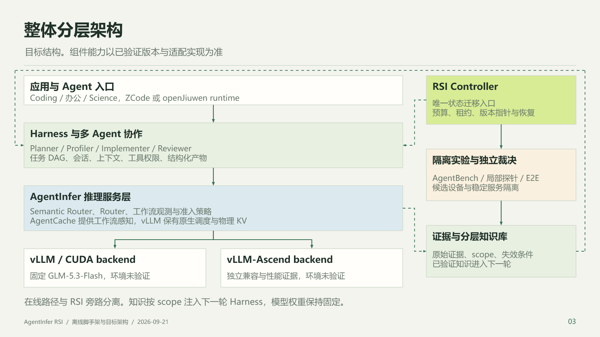
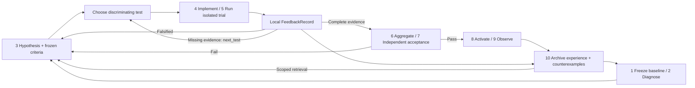

# AgentInfer RSI: dense feedback and scoped knowledge

This proposal adds an independent RSI control plane alongside AgentInfer serving. RSI here improves agent workflows,
routing, caching and inference implementations with fixed model weights. It does not train or update weights.
This PR implements an offline Python scaffold and an interactive prototype. Real ZCode orchestration, device probes,
candidate builds, independent acceptance and deployment adapters remain unconnected. Dashboard performance and patches
are synthetic examples.

## Dense feedback

The [16-slide Chinese presentation](../../assets/rsi/agentinfer-rsi-guide-zh.pptx) includes speaker notes.
Figures: [layered architecture](../../assets/rsi/rsi-layered-architecture.png),
[backend layers](../../assets/rsi/rsi-backend-layers.png), [numbered loop](../../assets/rsi/rsi-numbered-loop.png),
[dense feedback](../../assets/rsi/rsi-dense-feedback.png). Architecture and feedback also have SVG/Mermaid sources.

[The Z.ai article](https://z.ai/blog/glm-built-its-inference-infrastructure) describes local, timely, objectively
checkable
feedback on correctness, system behavior and performance. The modules and contracts below are our proposed
implementation,
not a claim about unpublished code behind the article.

Each hypothesis specifies affected layers, predicted effects, falsification conditions, the cheapest discriminating
test,
frozen acceptance criteria and a budget. A trial yields multiple local checks, with evidence and a concrete next test.
For a suspected KV-transfer host stall, compare matched prefill-only and prefill-plus-transfer timelines, then use
ablations,
numerical checks and unprofiled end-to-end measurements. The hypothesis determines the order of tests.
More logs or an LLM-generated score alone do not constitute dense feedback.

## Component planes

| Plane | Responsibilities |
| --- | --- |
| Agent entry | openJiuwen, ZCode and third-party agents submit tasks; a future ZCode adapter runs optimization roles |
| Harness | Task DAG, independent sessions, context snapshots, tools, sandboxes, budgets, artifact contracts and lifecycle events |
| Online routing | Semantic Router, Router and Global Scheduler handle policies and Agent/DP/PD-aware requests with session version pinning |
| Inference | vLLM or vLLM-Ascend executes requests; Agent Cache uses plugins while physical KV remains engine-owned |
| RSI control | Controller and Runner coordinate experiment DAGs, leases, budgets and candidate manifests; optimizers use stable model serving |
| Feedback | Probes, validators and Evidence Store retain attributable correctness, behavior and performance evidence with next_test |
| Knowledge | System contracts, component facts, trial experience, counterexamples and invalidation conditions, retrieved within exact scope |
| Acceptance/release | Independent rules and held-out tasks; accepted, active and last_good remain distinct; recovery is reconciled |
| Human interface | Dashboard, command API and audit expose progress, diffs, evidence, interventions and conflicts |

This is the target architecture. See the [how-to](../how-to/run-rsi-demo.md) for implemented boundaries.

## Seven logical backend layers

Both backends share a logical taxonomy but have independent versions, model revisions, hardware, shapes, dtypes,
topologies and workloads. This is a responsibility map, not a requirement for matching source directories.
Parallelism crosses engine/worker boundaries and fused operators may span layers. `model_scripts` means model
implementation
and adaptation, not shell scripts. Worker includes ModelRunner input preparation and graph execution.

| Layer | Change surface | Dense checks |
| --- | --- | --- |
| api_server | Parsing, streaming, cancellation, tool-call protocol | Schema/SSE integrity, cancellation propagation, failure behavior and host overhead |
| engine | Admission, scheduling, batching, KV lifecycle | Queue/fairness traces, prefill/decode breakdown and KV invariants |
| worker | ModelRunner, tensor preparation, graph capture/replay | Host/device timelines, replay equivalence, synchronization and OOM behavior |
| model_scripts | Layers, weight loading, attention/MoE and precision adapters | Reference logits/layer outputs, shape and dtype coverage |
| parallel | TP/DP/EP/PP/CP placement and rank groups | Controlled strategy comparisons, cross-rank correctness, imbalance and communication paths |
| ops.communication | Collectives, P2P, KV transfer and overlap | Integrity, ordering/deadlock, bandwidth/latency and overlap; validate NCCL and HCCL separately |
| ops.compute | Attention, GEMM, MoE and fused kernels | Numerical error, shape coverage, microbenchmarks and final end-to-end impact |

Kernel speedup does not establish task quality, and CUDA evidence cannot establish Ascend compatibility.
TTFT, request TPOT and token ITL are separate measures, especially with speculative decoding.
Profiled measurements are diagnostic and cannot establish final performance acceptance.

## Multi-agent collaboration and loops

Planner freezes hypotheses and minimal experiments; Profiler interprets observations and proposes falsification tests;
Implementer writes isolated candidate changes; Reviewer checks diffs, boundaries and coverage.
They can use one stable local model service, but use separate sessions, worktrees and write scopes.
They exchange structured artifacts through a task DAG rather than an unbounded shared conversation.

Harness assigns run/hypothesis/candidate/task IDs, records tool calls, cost, timeouts, cancellation and artifact URIs.
Context contains system contracts, matching component knowledge and valid counterexamples. Held-out tasks and
evaluator policy
are not supplied to optimization roles. Roles cannot change acceptance thresholds, self-validate knowledge or deploy
production.
The deterministic Controller authorizes actions; Runner holds isolated resource leases. Independent evaluation is not
an agent judging its own patch.

1. Local loop: 3→4→5→feedback→3/5, selecting cheap discriminating experiments within budget.
2. Acceptance loop: 6→7→8→9; acceptance changes accepted, confirmed activation changes active, successful observation
changes last_good.
3. Knowledge loop: 10→knowledge→1/2/3, retaining both successful and failed outcomes for subsequent hypotheses.

The target flow can send INCONCLUSIVE at 7 back to 5 for additional evidence; FAIL returns to 3.
In this scaffold, `retry` sends both outcomes to 3 for a newly frozen attempt. A failed observation returns to 8 for
recovery and then 10.
Unknown activation needs reconciliation. Failed recovery enters `needs_recovery` and blocks further rounds.

## Knowledge and intervention

`agentinfer/rsi/knowledge/` owns the repository. Runtime state, events, idempotency and knowledge history live in
`state.sqlite`
outside Git. A future Evidence Store holds large traces, profiles and tensor dumps; SQL stores references.

There are 22 namespaces: system, semantic-router, router, scheduling, harness, agent-cache, plus the two backend roots
and seven layers under each. System knowledge captures SLOs, contracts, compatibility and cross-component dependencies.
Component knowledge captures source entry points, mechanisms, invariants and checks. Trial experience captures
hypotheses,
changes, before/after values, evidence, applicability, counterexamples and invalidation conditions.

Retrieval first exactly matches project scope, backend, component_version and workload, then searches text.
Shared `agnostic` contracts require an explicit separate query and merge. Proposals start as draft; reviewed requires
source-review evidence.
Setting validated is intentionally unavailable until a trusted evidence verifier exists. Changed
engine/model/topology/workload
requires revalidation or stale status. A vector database is not necessary for the first implementation.

Dashboard explains the current stage, roles, hypothesis, diffs, evidence gaps, next tests, end-to-end effects,
knowledge and release decisions.
Production intervention should carry actor, reason, authorization, idempotency key and expected revision through the
Controller.
Current HTML controls modify browser-local simulation; the Python API modifies separate SQLite demo state. The API
snapshot is read-only.
Event integration, SSE/polling cursors and reconciliation precede connecting a real Runner.

## Primary references and unverified compatibility

- [Z.ai article](https://z.ai/blog/glm-built-its-inference-infrastructure): inference optimization and feedback
  environment.
- [vLLM architecture](https://docs.vllm.ai/en/latest/design/arch_overview.html),
  [metrics](https://docs.vllm.ai/en/latest/design/metrics/),
  [profiling](https://docs.vllm.ai/en/latest/contributing/profiling/) and
[parallelism](https://docs.vllm.ai/en/latest/serving/parallelism_scaling/).
- [Ascend
  profiling](https://docs.vllm.ai/projects/ascend/en/main/developer_guide/performance_and_debug/service_profiling_guide.html).
- [ZCode](https://github.com/zai-org/ZCode) and [GLM-5.3-Flash](https://huggingface.co/zai-org/GLM-5.3-Flash):
  intended integration targets.

This PR does not establish model/engine/device compatibility. Pin commits, model revision, drivers/CANN, devices and
tool-call protocol
and validate separately for each backend before claiming support.
