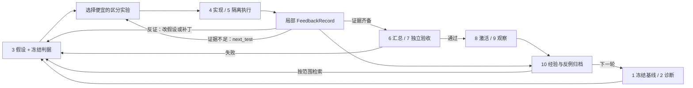

# AgentInfer RSI：稠密反馈与分层知识架构

本方案在 AgentInfer 在线推理链路旁增加独立 RSI 控制平面。RSI 指固定模型权重下，依据实验证据改进
Agent 工作流、路由、缓存和推理实现；本次不实现模型训练或权重自更新。

本提交是可运行的离线 Python 骨架和交互原型。真实 ZCode 调度、GPU/NPU 探针、候选构建、独立验收及发布适配器尚未接入。
界面的性能、补丁和知识示例均为演示数据，不代表仓库已有这些性能收益。

配套[16 页中文讲解 PPT](../../assets/rsi/agentinfer-rsi-guide-zh.pptx)包含逐页演讲备注。
独立图片：[完整分层架构](../../assets/rsi/rsi-layered-architecture.png)、
[后端七层](../../assets/rsi/rsi-backend-layers.png)、[十步循环](../../assets/rsi/rsi-numbered-loop.png)、
[稠密反馈与知识回路](../../assets/rsi/rsi-dense-feedback.png)。总图与反馈图另有同名 SVG / Mermaid 源文件。

## 稠密反馈为什么是核心

[智谱的文章](https://z.ai/blog/glm-built-its-inference-infrastructure)强调把目标拆成局部、及时且可客观验证的反馈，
包括数值正确性、系统行为和性能。这里将其设计成 `feedback/` 服务与 `knowledge/` 经验闭环，
不是把更多日志交给 LLM 打一个总分。下面的模块和字段是本项目提案，不是文章公开的现成实现。

每个假设先写下：受影响层、预测变化、反证条件、最便宜的区分实验、冻结验收规则和预算。
一个实验可以产生多个局部检查，失败后直接告诉对应 Agent 下一步测什么。
例如 KV 传输导致 host 阻塞的假设，先比较相同负载的 prefill-only 与 prefill+transfer 时间线；
再做局部消融、数值校验和无 profiler 的端到端测量。实验顺序由假设决定，不能硬编码成所有任务统一的一条测量流水线。

## 分层组件与职责

| 平面 | 组件 | 职责与边界 |
| --- | --- | --- |
| 任务入口 | openJiuwen / ZCode / 第三方 Agent | 发起业务任务；ZCode 拟通过独立 adapter 运行优化角色 |
| Agent 运行层 | Harness | Task DAG、角色会话、上下文快照、工具权限、沙箱、预算、产物协议与生命周期事件 |
| 在线路由 | Semantic Router、Router、Global Scheduler | 语义策略、请求分配、Agent/DP/PD-aware 调度，版本固定到会话 |
| 推理执行 | vLLM / vLLM-Ascend 七层能力地图 | 执行真实推理；Agent Cache 接插件，物理 KV 仍由引擎持有 |
| RSI 控制面 | Controller / Experiment Runner | 实验 DAG、资源租约、状态转移、预算、候选清单；独立稳定模型服务为优化 Agent 提供推理 |
| 反馈面 | Probe / Validator / Evidence Store | 局部正确性、行为、性能检查；保存可复现证据、反馈归因与 next_test |
| 知识面 | Knowledge Repository / Curator | system 契约、组件知识、实验经验、失败反例、失效条件；按适用范围检索 |
| 裁决与发布 | Independent Evaluator / Promotion | 固定规则、独立保留任务集、accepted/active/last_good 分离、恢复及对账 |
| 人机协作 | Dashboard / Command API / Audit | 展示流程、改动、证据与知识；人工指令经过 revision 和幂等校验 |

以上是目标架构，已实现范围见[使用指南](../how-to/run-rsi-demo.md)。

### vLLM 与 vLLM-Ascend 七层逻辑拆分

两种后端使用相同逻辑分类，但分别固定版本、模型 revision、硬件、dtype、shape、并行拓扑与负载。
这是一张责任地图，并不要求源码有同名目录；parallel 跨越 engine/worker，融合算子也可能跨边界。
`model_scripts` 表示模型实现和适配代码，并非启动 shell 脚本。Worker 包含 ModelRunner 的输入准备与图执行职责。

| 层 | 主要改动点 | 稠密反馈 / 必要对照 |
| --- | --- | --- |
| `api_server` | 请求解析、流式输出、取消、工具调用协议 | schema/SSE/tool-call 完整性、取消传播、异常路径、host 开销 |
| `engine` | 准入、调度、批次、KV 生命周期 | 队列/公平性、调度轨迹、prefill/decode 分段、KV 不变量 |
| `worker` | ModelRunner、张量准备、graph capture/replay、设备执行 | host/device 时间线、图回放一致性、同步点、OOM |
| `model_scripts` | 模型层、权重加载、attention/MoE/精度适配 | 固定输入的 logits/层输出误差、shape/dtype 覆盖、reference 对照 |
| `parallel` | TP/DP/EP/PP/CP 映射、rank 分组、分片 | 单并行策略对照、跨 rank 数值一致性、负载倾斜、通信路径 |
| `ops.communication` | collective、P2P、KV transfer、通信重叠 | 数据完整性、顺序与死锁、带宽/时延、overlap；CUDA/NCCL 与 Ascend/HCCL 独立验证 |
| `ops.compute` | attention、GEMM、MoE、融合 kernel | 数值误差、shape 覆盖、microbenchmark、最终端到端收益 |

局部 kernel 加速不能推出任务成功率提升；CUDA 结果不能证明 Ascend 可用。TTFT、请求 TPOT 与 token 间 ITL 分别记录，
尤其 speculative decoding 下不能互换。Profiler 影响计时，诊断样本不能用作最终性能验收。

## 多 Agent 与 Harness

Planner 冻结假设与最小实验；Profiler 解释观测并提出反证实验；Implementer 在候选 worktree 中改动；
Reviewer 审查差异、边界与测试覆盖。角色按任务 DAG 协作，交换带 ID 的结构化产物，避免共享无限增长的聊天历史。
四个角色可以共用固定版本的本地模型服务，但必须有独立会话和写入范围。

Harness 给每次任务发放 `run_id / hypothesis_id / candidate_id / task_id`，记录调用、成本、超时、取消和产物 URI。
知识注入只包含 system 契约 + 匹配的组件知识 + 有效反例；保留评测集及裁决策略不注入优化角色。
角色无权直接修改验收门槛、把经验标为 validated 或发布生产版本。CPU Controller 做确定性授权，Runner 持有独占实验资源租约。
独立 Evaluator 不是第五个给自己补丁打分的聊天 Agent。

### 三重反馈循环

1. **局部优化环：3→4→5→反馈→3/5。** 低成本反馈及时证伪，在明确预算内选择下一项实验。
2. **系统验收环：6→7→8→9。** 独立验收通过才设置 accepted；部署确认后改 active；观察通过后改 last_good。
3. **经验进化环：10→知识库→1/2/3。** 成功和失败都归档；下一轮更快选择假设，而不是重复失败配置。

目标流程中 7 的 INCONCLUSIVE 可回 5 补证据，FAIL 回 3 改假设；当前骨架的 `retry` 统一回 3，重新冻结后再做实验。
9 失败回 8 恢复旧稳定版本，再到 10。激活状态未知先对账，恢复失败进入 `needs_recovery`，禁止开始新轮。

## 知识库在哪里

核心实现放在 `agentinfer/rsi/knowledge/`，持久化放在运行目录的 `state.sqlite`，不把运行数据提交到 Git。
本次 SQLite 保存知识、版本历史、运行状态与事件；大型 traces、tensor dumps、profile 文件将由后续 Evidence Store 保存，SQL 仅存指针。

共 22 个命名空间：system、semantic-router、router、scheduling、harness、agent-cache；vllm 与 vllm-ascend 的根知识各一个，
再分别包含七个层级。system 保存全局约束、SLO、版本兼容关系及跨组件依赖；组件知识保存代码入口、机制、不变量和检查方法。
实验经验保存假设、改动、前后值、证据引用、适用范围、失败反例与失效条件。

检索必须先精确匹配项目 scope、backend、component_version、workload，再搜索文本。
共享的 `agnostic` 契约必须单独查询、显式合并，不能通配符式混入某个后端结论。
候选经验从 draft 开始，可人工审阅为 reviewed；validated 需要未来可信证据验证器，本次 API 明确拒绝直接标记 validated。
升级引擎、模型、拓扑或负载后应重新验证或标记 stale，不沿用过期结论。没有必要在初版先部署向量数据库。

## 人工干预与可观测性

Dashboard 同时回答：当前第几步、哪个假设和 Agent 在工作、哪些文件变化、局部检查是否齐备、
哪项实验区分度最高、端到端效果如何、哪些知识被读写、为什么晋级或回滚。
命令包括暂停新任务、恢复、调预算、排除候选、重新实验、确认发布及恢复。
生产版本应记录操作者、原因、权限、幂等键与期望 revision，并由 Controller 接收，不允许页面直接写部署系统。

当前 HTML 是浏览器本地模拟；Python API 是独立 SQLite demo 状态。只读快照入口能检查 API，HTML 的模拟按钮不等于真实控制器命令。
后续接线需要统一事件协议、SSE/轮询游标与恢复对账，再连接真实 Runner。不要把演示状态冒充生产遥测。

## 资料与能力验证边界

- [Z.ai 文章](https://z.ai/blog/glm-built-its-inference-infrastructure)：反馈环境与推理优化案例。
- [vLLM architecture](https://docs.vllm.ai/en/latest/design/arch_overview.html)：API server、Engine、Worker 与 ModelRunner
  的职责。
- [vLLM metrics](https://docs.vllm.ai/en/latest/design/metrics/) 与
  [profiling](https://docs.vllm.ai/en/latest/contributing/profiling/)：观测与诊断路径。
- [vLLM parallelism](https://docs.vllm.ai/en/latest/serving/parallelism_scaling/)：并行部署边界。
- [Ascend service
  profiling](https://docs.vllm.ai/projects/ascend/en/main/developer_guide/performance_and_debug/service_profiling_guide.html)：NPU
  诊断适配路径。
- [ZCode](https://github.com/zai-org/ZCode) 与 [GLM-5.3-Flash](https://huggingface.co/zai-org/GLM-5.3-Flash)：目标 Agent
  与模型，未在本 PR 验证组合兼容性。

具体模型、引擎 commit、驱动/CANN、设备和工具调用协议需逐后端验证；本 PR 不宣称 GLM-5.3-Flash 在上述全部层级和设备上已可运行。
