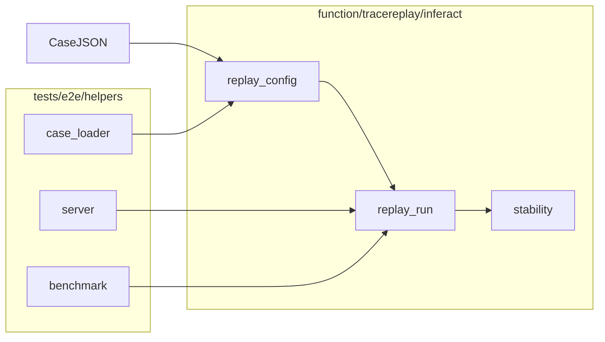

# E2E functional tests (`tests/e2e/function`)

Correctness-oriented GPU/NPU E2E checks live here. They are **not** performance A/B suites (`tests/e2e/perf/`).

Default CI skips all of `tests/e2e` (`pytest --ignore=tests/e2e`). Run these on a machine with vLLM,
weights, and (for replay) trace files.

## Position in the repo

```text
tests/e2e/
├── helpers/          # shared: case JSON, vLLM lifecycle, validate_completed_run
├── perf/             # BenchKit plan-subagent; baseline vs AgentInfer
└── function/         # this tree — replay repeatability, future serve smoke, etc.
    └── tracereplay/
        └── inferact/ # only implemented suite today
```

| Concern | `perf/` | `function/` (Inferact replay) |
| ------- | ------- | ----------------------------- |
| Bench command | `vllm bench serve --agentinfer run` (BenchKit) | `vllm bench serve --agentinfer replay` |
| Default YAML | `swebench_vllm.yaml` (in case) | `replay_inferact.yaml` |
| Pass criteria | Completes; perf compare elsewhere | Completes + optional **cold-start repeatability** |
| Case JSON | `scenario`: baseline / agentinfer | `scenario`: **baseline** + `workload`: **inferact-replay** |

Both reuse [`../helpers/`](../helpers/) for loading case JSON and managing `vllm serve`.

## Directory layout

```text
function/
├── README.md
├── __init__.py
└── tracereplay/
    ├── __init__.py
    └── inferact/
        ├── README.md           # commands, stability table, case matrix
        ├── conftest.py         # pytest CLI options
        ├── run_replay.py       # test_inferact_replay
        ├── cases/*.json        # serve + replay parameters
        └── helpers/            # Inferact-only harness (not shared with perf)
            ├── replay_config.py
            ├── replay_run.py
            ├── stability.py
            └── request_intervals.py
```

Add another replay trace type as **`tracereplay/<name>/`** (sibling of `inferact/`), with its own
cases, bench YAML, and helpers—or shared repeatability helpers if the criteria match.

## Inferact replay flow (summary)

1. **Load** case JSON → `ReplayE2EConfig` (`replay_config.py` + `../helpers/case_loader.py`).
2. **Check** model path, `vllm` on PATH, `replay_inferact.yaml`, `benchmark_params.trace-path`.
3. **Serve** vLLM via `managed_vllm` (`../helpers/server.py`) using `server_params` from the case.
4. **Replay** subprocess: `vllm bench serve --agentinfer replay` with CLI overrides (trace, model, base URL, task-num, max-concurrency).
5. **Validate** result dir (`../helpers/benchmark.py` → `validate_completed_run`).
6. **Repeatability** (optional): run step 3–5 twice with a full vLLM stop between runs; compare
   summaries + `requests.jsonl` intervals (`stability.py`).



## Pytest entrypoint (Inferact)

Single test **`test_inferact_replay`**: two cold vLLM + replay cycles, then stability comparison.

See [`tracereplay/inferact/README.md`](tracereplay/inferact/README.md) for the command and metric tiers.

## Case JSON contract (Inferact)

| Section | Role |
| ------- | ---- |
| `serve_env` | Extra env for `vllm serve` (Ascend/HCCL, etc.) |
| `server_params` | Model path, middleware (empty for replay E2E), `serve_args` (port, TP, scheduler, …) |
| `result_root` | Parent dir for `run-<hardware>-local-replay-...` folders |
| `benchmark_params.workload` | Must be `inferact-replay` (harness guard) |
| `benchmark_params.trace-path` | Full Inferact JSON passed to `--trace-path` |
| `benchmark_params.host/port/model` | Replay client targets |
| `benchmark_params.task-num` / `max-concurrency` | Overridable via pytest `--task-num` / `--max-concurrency` |

Agentbench replay semantics (trace adapter, interval mode) stay in
**`agentinfer/agentbench/configs/replay_inferact.yaml`**; the E2E harness does not fork that file.

## External artifacts

| Artifact | Role |
| -------- | ---- |
| [`replay_inferact.yaml`](../../../agentinfer/agentbench/configs/replay_inferact.yaml) | `trace_type: inferact_codex_swebenchpro`, backend, intervals |
| [Inferact `codex_swebenchpro.json`](https://huggingface.co/datasets/Inferact/codex_swebenchpro_traces) | Trace source; path set in case JSON |
